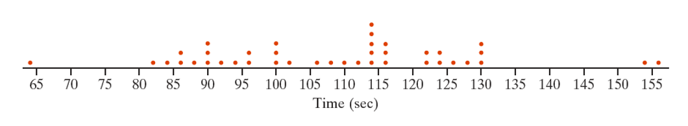
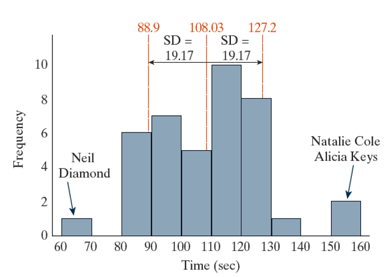

## Chapter P Learning Objectives {.center}

-   Understand the 6-step process.
-   Be able to classify variables as quantitative or qualitative.
-   Be able to interpret a histogram.
-   Understand the difference between a skewed and symmetric distribution.
-   Know how to measure the center of data using either a mean or median.

##  {.center style="font-size: 72px;"}

::: r-stack
**What do you think of when you hear the word "statistics"?**
:::

## Anecdotal Evidence

"I will never start jogging because my friend’s dad jogged his whole life, but he died at age 46 from a heart attack.”    “Don’t get your child vaccinated. I had my child vaccinated and now he is autistic.”    “My friend tried a new diet and lost weight so quickly- that diet must work really well.”

##  {.center style="font-size: 72px;"}

**Statistics** allow us to estimate something about a broad population.

## Helper vs. Hinderer

::::: columns
::: {.column width="35%"}
  {fig-alt="Angry baby"}

[Link to Helper vs Hinderer Video](https://www.youtube.com/watch?v=HBW5vdhr_PA)
:::

::: {.column width="65%" style="font-size: 32px"}
In a study reported in a November 2007 issue of Nature, researchers investigated whether infants take into account an individual’s actions towards others in evaluating that individual as appealing or aversive, perhaps laying the foundation for social interaction (Hamlin, Wynn, and Bloom, 2007).

The video describes the study that was done to test this theory, using "helper" and "hinderer" toys.
:::
:::::

# P.1: Introduction to the Six-Step Method

## The Six-Step Method Overview {.center}

1.  Ask a research question
2.  Design a study and collect data
3.  Explore the data
4.  Draw inferences beyond the data
5.  Formulate conclusions
6.  Look back and ahead

## 1. Ask a research question {.center}

-   What do you want to know or investigate?
-   It does not have to be super specific

Helper vs. Hinderer example:

-   Do babies show a preference for the helper toy or the hinderer toy after being shown a puppet show?

    -   We're REALLY investigating nature vs. nurture

## 2. Design a study and collect data {.center}

-   How will you test for your question?
-   What kind of data should be collected?

Helper vs. Hinderer example:

-   Recruit babies
-   Show each baby the puppet show
-   Record which toy the baby chooses

## 3. Explore the data {.center}

-   **Visually:** Create boxplots, histograms, other graphs/charts
-   **Numerically:** Compute a number

Helper vs. Hinderer example:

-   14 picked the helper, 2 picked the hinderer

    -   Proportionally: 14/16 = 0.875

## 4. Draw inferences beyond the data {.center}

-   What might our results imply?
-   Did our data result from chance alone?
-   Is there an underlying cause?

Helper vs. Hinderer example:

-   Is 14/16 large enough to conclude babies prefer the helper toy?

-   Did 14 choose the helper by chance?

    -   Perhaps the puppet show had an influence.

## 5. Formulate conclusions {.center}

-   Strong evidence = form a conclusion
-   Weak evidence = data was inconclusive
-   Can often generalize to a population

Helper vs. Hinderer example

-   Conclusion: Babies preferred the helper toy over the hinderer toy, when shown the puppet show.
-   Can we say this about all babies?

## 6. Look back and ahead {.center}

-   What was good about the experiment?
-   What could be improved?
-   Future research?

Helper vs. Hinderer example:

-   Recruit more babies

## Four Pillars of Statistical Evidence {.center}

1.  **Significance:** How strong is the evidence of an effect?
2.  **Estimation:** What is the size of the effect?
3.  **Generalization:** How broadly do conclusions apply?
4.  **Causation:** Can we say what caused the observed difference?

. . .

**Typically, the pillars apply during step 4 or 5 of the six-step process.**

## Basic Definitions {.center}

## Data {.center}

Values measured or categories recorded on individual entities of interest.

## Observational Units {.center}

The individual entities on which the data is recorded.

## Variables {.center}

The recorded characteristics of the observational units.

## Quantitative (or Numerical) Data {.center}

Variables which take on numerical values

-   Ex: Height, age, number of pets, 40-yard dash time

## Qualitative (or Categorical) Data {.center}

Variables which take on category designations

-   Ex: Hair color, marital status, selecting A, B, or C on a multiple-choice question

## Helper vs. Hinderer Example

-   What were the observational units?

[**Each baby**]{.fragment}

-   What variable was being observed?

[**Whether the baby chose the helper or hinderer**]{.fragment}

-   Was the variable numerical or categorical?

[**Categorical**]{.fragment}

# P.2: Exploring Data

## Describing Data {.center}

## Distribution {.center}

Describes the pattern of value/category outcomes for a variable.

::: notes
Six-sided die example with 3 sides being 3, 2 being two and 1 being one.
:::

## Describing a Distribution {.center}

## Shape {.center}

Symmetric, mound-shaped, skewed? How many ”peaks”?

## Center {.center}

Where does the center of the pattern appear?

-   Generally refers to mean or mode

## Variability {.center}

How spread out is the distribution?

-   Generally described in terms of [**standard deviation**]{.underline}
-   Variability will be a big topic in this class!

## Unusual Data {.center}

-   Outliers
-   Outliers can affect results- so we need to be aware of them.

## National Anthem Example {style="font-size: 30px;"}

| Year | Super Bowl | Performer          | Genre    | Time (sec) |
|------|------------|--------------------|----------|------------|
| 2019 | 53         | Gladys Knight      | R&B/Soul | 121        |
| 2018 | 52         | Pink               | Pop      | 113        |
| 2017 | 51         | Luke Bryant        | Country  | 124        |
| 2016 | 50         | Lady Gaga          | Pop      | 129        |
| 2015 | 49         | Idina Menzel       | Pop      | 124        |
| 2014 | 48         | Renee Fleming      | Opera    | 114        |
| 2013 | 47         | Alicia Keys        | Pop      | 155        |
| 2012 | 46         | Kelly Clarkson     | Pop      | 94         |
| 2011 | 45         | Christina Aguilera | Pop      | 114        |
| 2010 | 44         | Carrie Underwood   | Country  | 107        |

## National Anthem Example (cont.) {.center}

Dot plot of National Anthem length:

{fig-alt="Dot plot of National Anthem length in seconds. Outliers include a dot at 64 seconds and dots at 154 and 156 seconds."}

## National Anthem Example (cont.) {style="font-size: 32px"}

::::: columns
::: {.column width="40%"}
How would you describe the distribution?

-   Shape:
-   Center:
-   Variability:
-   Standard Deviation:
-   Outliers:
:::

::: {.column width="60%"}
{fig-alt="Histogram of National Anthem length in seconds. Outliers are Neil Diamond between 60 and 70 seconds, and Natalie Cole and Alicia Keys between 150 and 160 seconds. The mean is 108.03 seconds with a standard deviation of 19.17 seconds."}
:::
:::::

# P.3: Exploring Random Processes

## In the long run... {.center}

-   Beneficial to run many experiments
-   Simulations come in handy
-   Can observe long term patterns or "behavior"
-   Interest in long-run (long term) probability of an outcome

## Cars vs. Goats Exploration {.center style="font-size: 35px"}

::::: columns
::: {.column width="60%"}
-   Inspired by the classic Monty Hall problem from Let's Make a Deal!
-   Three doors; two goats, one car
-   After one door is revealed, should you switch or stay with your choice?
-   Goal: Use simulation to determine a long-run trend
-   [Monty Hall Applet](https://www.isi-stats.com/isi2nd/ISIapplets2020.html) demo
:::

::: {.column width="40%"}
{width="110%" height="110%" fig-alt="Goat lying down with caption 'Don't worry you goat this.'"}
:::
:::::
