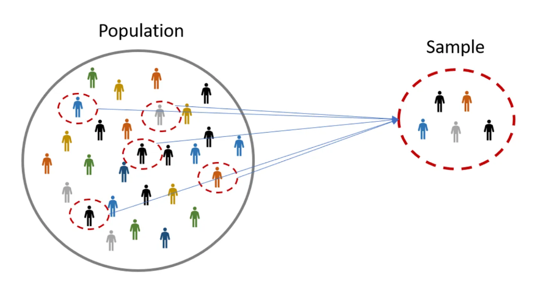
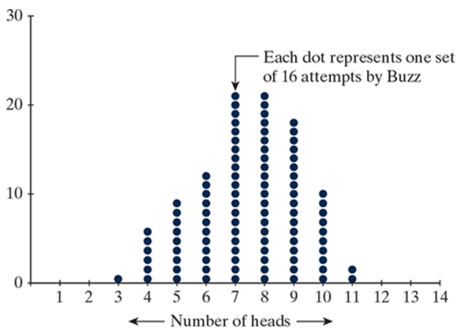

## Section 1.1 Learning Objectives {.center}

-   Know the difference between a parameter and a statistic.

-   Identify whether or not study results are statistically significant and whether or not the chance model is a plausible explanation for the data.

## Recall...

-   Statistics allow us to estimate something about a large population
-   Statistical significance
    -   Were our results likely by random chance?
    -   Is there an underlying cause?
-   Probabilities
    -   Interested in the long-run probabilities

    -   Cars vs. Goats

# More Definitions! {.center}

## Population {.center}

The complete collection of **all** objects that are of interest for a given scenario.

-   Ex: All UNL students, everyone in the United States.

## Parameter {.center}

The long-run numerical property of the population.

## Sample {.center}

A subset of observational units from the population of interest

## Sample Size {.center}

The number of observational units in the sample

-   We denote sample size using "n"

## Statistic {.center}

The numerical property summarizing the result of the sample

# Population vs. Sample {.center}

{fig-alt="Large circle labeled 'Population' containing figures and a smaller circle labeled 'Sample' containing a subset of figures from the large circle."}

##  {.center}

::::: columns
::: {.column width="55%"}
### [P]{.underline}opulation ⟾ [P]{.underline}arameter

A parameter is based on a population. Parameters are generally difficult or impossible to obtain.
:::

::: {.column width="45%"}
### [S]{.underline}ample ⟾ [S]{.underline}tatistic

A statistic is based on a sample. A statistic can [always]{.underline} be obtained.
:::
:::::

## Helper vs. Hinderer Example

-   [**Population:**]{.underline} [All babies in the United States]{.fragment}

-   [**Parameter:**]{.underline} [Long run proportion of babies that choose the helper toy (unknown!)]{.fragment}

-   [**Sample:**]{.underline} [Babies that participated in the experiment]{.fragment}

    -   [Sample size (n = 16)]{.fragment}

-   [**Statistic:**]{.underline} [Observed proportion of babies that chose the helper toy (14/16)]{.fragment}

## A note on wording... {.center}

"Long-run" and "true" can be used interchangably

-   Long-run proportion = true proportion

-   Long-run average = true average

. . .

In either case, we are describing a [**parameter**]{.underline}

# Doris and Buzz Example

{fig-alt="Man on the edge of a pool with a dolphin in it."}

## Doris and Buzz {style="font-size: 35px"}

In 1964, two dolphins (Doris and Buzz) were trained to push one of two buttons in a pool in reaction to a light. If the light flashed, the dolphins pushed the button on the left to get a fish. If the light was constant, the dolphins needed to push the button on the right.

Once they learned this behavior, the dolphins were separated by a wall (only Doris could see the light; only Buzz could push the buttons). To get a fish, Doris would need to communicate with Buzz.

The researcher, randomly deciding to make the light shine constant or flash, tested the dolphins’ ability to communicate.

Out of 16 attempts, the dolphins pushed the correct button 15 times.

# Doris and Buzz: Six Steps of Statistical Investigation

## 1. Ask a research question. {.center}

::: incremental
-   Can dolphins communicate in an abstract manner?
:::

## 2. Design a study and collect data. {.center}

::: incremental
-   Observational units?

    -   How many? (Sample size)

-   Variable of interest?

    -   Categorical or quantitative?
:::

## 3. Explore the data. {.center}

::: incremental
-   Out of 16 attempts, the correct button was pushed 15 times.

-   What is our sample? Observed statistic?
:::

## 4. Draw inferences beyond the data. {.center}

::: incremental
-   The long run proportion of correctly pushing the button is unknown

    -   This is our parameter

-   Our observed statistic helps estimate the parameter
:::

## 5. Formulate conclusions. {.center}

::: incremental
-   Were our results purely random? (Buzz was just guessing)

-   Was there an underlying cause? (Buzz and Doris were communicating)
:::

## 6. Look back and ahead. {.center}

::: incremental
-   How could we improve this study?
:::

##  {.center style="font-size: 72px;"}

**How can we decide if our results are statistically significant?**

## We use the "Three S" Strategy {.center}

 

:::::: columns
::: {.column width="33%"}
### 1: Statistic

Compute a statistic from the sample data.
:::

::: {.column width="33%"}
### 2: Simulate

Develop a chance model. Repeatedly simulate values of the statistic under this model.
:::

::: {.column width="33%"}
### 3: Strength of Evidence

Decide if the observed statistic was likely based on the simulation.
:::
::::::

# Doris and Buzz: Three S Strategy

## 1. Statistic {.center}

Compute a statistic from the observed data.

-   Called our observed statistic.

Doris and Buzz example:

. . .

-   The proportion of times Buzz pushed the correct button

    -   15/16 = observed statistic

## 2. Simulate {.center}

-   Develop a "chance model" (aka, a null model)

-   Chance model = what we would expect to happen at random, [assuming there is no underlying cause]{.underline}

-   Under the chance models, repeatedly simulate values for our observed statistic.

-   This develops a sampling distribution (aka, a null distribution)

. . .

How might we simulate Doris and Buzz's experiment?

## 3. Strength of Evidence {.center}

Based on our simulated values, **is our observed statistic likely?**

-   If the observed statistic seems likely:

    ::: fragment
    -   The chance (null) model was possible.

    -   Our results could've happened by random chance alone
    :::

-   If the observed statistic seems unlikely:

    ::: fragment
    -   Our chance (null) model likely wasn't possible

    -   There's probably some underlying cause
    :::

## Connecting Simulation to a Real Study

We could simulate this study by flipping a coin

::: incremental
-   Coin flip = a guess by Buzz

    -   Heads = a correct guess
    -   Tails = an incorrect guess

-   Chance of heads = 1/2; probability of pushing the correct button if Buzz is guessing

-   One repetition = one set of 16 simulated attempts by Buzz

    -   Flipping the coin 16 times = one repetition
:::

## Simulating a Null Distribution Activity

-   Using a simulator, simulate 16 coin tosses

-   Record the number of heads

-   Mark an "X" above the number of heads you got

What does each "X" represent?

## Simulation using the Applet {style="font-size: 35px"}

Now we'll carry out simulation using the Applet

-   [Applet Link](https://www.isi-stats.com/isi2nd/ISIapplets2020.html)

What is our chance (null) model?

-   Adjust **Probability of Heads**

How many trials took place in the study?

-   Adjust **Number of Tosses**

The more samples the better! Run the simulation 1000 times.

-   Adjust **Number of Repetitions**

## Simulation using the Applet

:::::: columns
:::: {.column width="40%"}
At what point would we be convinced Buzz isn't guessing?

If Buzz correctly guessed...

::: incremental
-   10/16 times?
-   12/16 times?
-   14/16 times?
:::
::::

::: {.column width="60%"}
{width="110%" height="110%" fig-alt="Dot plot where each dot represents one set of 16 attempts by Buzz. Dots form a mound shape between 3 and 11 that peaks between 7 and 8."}
:::
::::::
