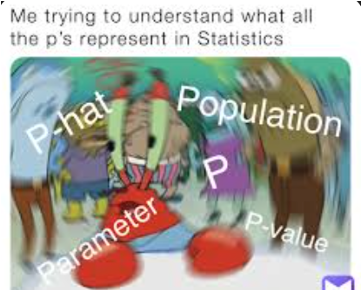
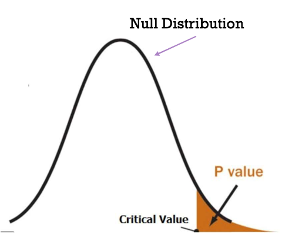
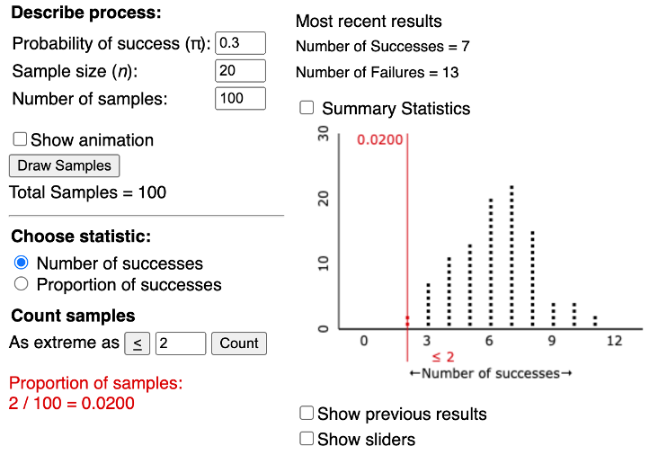
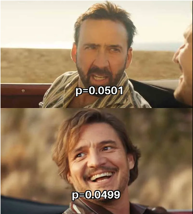

## Section 1.2 Learning Objectives {.center}

-   Understand that not all outcomes in an experiment are equally likely.

-   Understand what a null hypothesis represents.

-   Be able to represent a null hypothesis in both words and symbols.

-   Be able to interpret the p-value.

## Rock, Paper, Scissors {.center}

::::: columns
::: {.column width="50%"}
Consider a classic game of Rock, Paper, Scissors

-   Studies suggest scissors are chosen least
:::

::: {.column width="50%"}
{fig-alt="Rock, paper, and scissors clip art."}
:::
:::::

Let's put this to the test!

## Rock, Paper, Scissors (cont.) {.center}

In a game of Rock, Paper, Scissors...

-   What are the observational units?

-   What is the variable of interest?

Do we still have a binary outcome?

. . .

-   Yes: *Scissors or not*

## But first, symbols! {.center}

-   $\pi$ (pi) represents the **parameter**: The long run **proportion**
-   $\hat{p}$ (p-hat) represents the **observed statistic**: The value we observe from our **sample**
-   **n** is the **sample size**: The number of trials in an experiment (recall from last section)

## Helper vs. Hinderer Symbols Example {.center}

-   Parameter ($\pi$) = The long run proportion of times a baby choses the helper toy.

    -   Remember, this is unknown!!

-   Observed Statistic ($\hat{p}$) = 14/16

-   Sample size (n) = 16

## Rock, Paper, Scissors Activity {.center}

With a partner, play 20 games of rock paper scissors. Identify the following:

-   Observational units: [**Each game you play**]{.fragment}
-   Sample: [**Games played between you and your partner**]{.fragment}
-   Sample size (n): [**20**]{.fragment}
-   Categorical variable of interest: [**Scissors or not**]{.fragment}
-   Parameter ($\pi$): [**Long run proportion of scissors**]{.fragment}
-   Your observed statistic ($\hat{p}$)
-   Your partner's observed statistic ($\hat{p}$)

## Rock, Paper, Scissors Activity (cont.) {.center}

-   How many times did you expect your partner to throw scissors?

-   Did your observed statistic match your partner’s?

# Intro. to Hypothesis Testing

## Hypothesis Testing {.center}

-   Allows us to summarize and refine our research question.
-   Step 1 in the six-step process

## Hypothesis Testing (cont.) {.center}

-   Two hypotheses

-   Null hypothesis ($H_{0}$):

    -   The chance explanation.
    -   What we assume is true

-   Alternative hypothesis ($H_{A}$):

    -   What researchers think could be true.
    -   There's an underlying cause.

We can either write our hypotheses in words or symbols.

## Hypothesis Testing (cont.) {.center}

In words:

-   Null Hypothesis: The long run proportion of (*variable of interest*) is equal to (*hypothesized proportion*).
-   Alt. Hypothesis: The long run proportion of (*variable of interest*) is (*less than/greater than/not equal to hypothesized proportion*).

## Hypothesis Testing (cont.) {.center}

In symbols:

-   $H_{0}$: $\pi$ = (*hypothesized proportion*)
-   $H_{A}$: $\pi$ \>,\<,≠ (*hypothesized proportion*)

Note that our hypothesized proportion *will not be the same as our observed statistic!*

## Helper vs. Hinderer: Hypothesis Testing

In words:

-   Null: The long run proportion of times a baby chooses the helper toy is equal to 0.5
-   Alternative: The long run proportion of times a baby chooses the helper toy is greater than 0.5

::::: columns
::: {.column width="40%"}
In symbols:

-   $H_{0}$: $\pi$ = 0.5
-   $H_{A}$: $\pi$ = 0.5
:::

::: {.column width="60%"}
    [Where does 0.5 (1/2) come from?]{.fragment}
:::
:::::

## Rock, Paper, Scissors: Hypothesis Testing {.center}

**Research Question:** Is scissors thrown less often than rock or paper?

-   We're interested in $\pi$, the long run proportion of times someone picks scissors.

-   What might a good hypothesized value for $\pi$ be?

## Rock, Paper, Scissors: Hypothesis Testing {.center}

In words:

-   Null: The long run proportion of times a person throws scissors is equal to 1/3.

-   Alt: The long run proportion of times a person throws scissors is less than 1/3.

::::: columns
::: {.column width="50%"}
In symbols:

-   $H_{0}: \pi = \frac{1}{3}$
-   $H_{A}: \pi < \frac{1}{3}$
:::

::: {.column width="50%"}
    [Why are we using "\<"?]{.fragment}
:::
:::::

## Rock, Paper, Scissors: Three S Strategy {.center}

-   **Statistic:** How many times was scissors thrown? (Out of 20 games?)

## Rock, Paper, Scissors: Three S Strategy {.center}

-   **Simulate:** Using the Applet, simulate the chance model 1000 times.

    -   Compuare your observed statistic to the simulation.

[Link to One Proportion Applet](https://www.isi-stats.com/isi2nd/ISIapplets2020.html)

## Rock, Paper, Scissors: Three S Strategy {.center}

-   **Strength of Evidence:** How likely is your observed statistic against the simulation?

    -   "Eyeballing it" is not reliable
    -   Need a concrete method
    -   Enter p-value...

# P-value

## P-value {.center}

::::: columns
::: {.column width="60%"}
-   Reliable way to measure strength of evidence

-   [**P-value:**]{.underline} The probability of obtaining a simulated value of the statistic as or more extreme than the observed statistic when the null hypothesis is true.
:::

::: {.column width="40%"}
  {fig-alt="Meme captioned 'Me trying to understand what all the p's represent in statistics.'"}
:::
:::::

## P-value {.center}

::::: columns
::: {.column width="50%"}
-   Always between 1 and 0

-   Represents the proportion of simulated statistics as or more extreme than the observed statistic, in the direction of the alternative hypothesis

-   Smaller p-value = stronger evidence [**against**]{.underline} the null

    -   (Aka, in favor of our alternative!)
:::

::: {.column width="50%"}
  {fig-alt="Meme captioned 'Me trying to understand what all the p's represent in statistics.'"}
:::
:::::

## P-value Cutoffs {.center}

|                      |                                                  |
|----------------------|--------------------------------------------------|
| P –value \> .10      | Not much evidence against the null hypothesis    |
| .05 \< p-value ≤ .10 | Moderate evidence against the null hypothesis    |
| .01 \< p-value ≤ .05 | Strong evidence against the null hypothesis      |
| .01 ≥ p-value        | Very strong evidence against the null hypothesis |

## Hypothesis Testing and the Null Distribution {.center}

The Applet generates a null distribution

-   [**Null Distribution:**]{.underline} Simulated trials under the chance model

-   Will center at hypothesized value

[Link to One Proportion Applet](https://www.isi-stats.com/isi2nd/ISIapplets2020.html)

## Hypothesis Testing and the Null Distribution (cont.) {.center style="font-size: 30px"}

::::: columns
::: {.column width="40%"}
Rock, paper, scissors simulation example

-   Observed statistic ($\hat{p}$): 2/20

-   P-value = 0.02

[Based on this p-value, we would [reject the null hypothesis.]{.underline}]{.fragment}
:::

::: {.column width="60%"}
{fig-alt="Screenshot of a simulation ran using the One Proportion Applet."}
:::
:::::

## Drawing Conclusions from the P-value {.center}

::::: columns
::: {.column width="70%"}
Remember, we start out assuming our null hypothesis is true.
:::

::: {.column width="30%"}
{fig-alt="P-value meme."}
:::
:::::

## Drawing Conclusions from the P-value {.center}

If p-value ≤ .05:

-   Reject the null hypothesis
-   Observed statistic likely didn't occur by chance

## Drawing Conclusions from the P-value {.center}

If p-value \> .05:

-   Fail to reject the null hypothesis
-   Observed statistic could have happened by chance

## Putting it into words {.center}

If we reject our null hypothesis (p-value ≤ 0.05):

-   We have enough evidence to conclude (insert alternative hypothesis here).

## Putting it into words {.center}

If we fail to reject our null hypothesis (p-value \> 0.05):

-   We do not have enough evidence to conclude (insert alternative hypothesis here).

## Rock, Paper, Scissors Conclusion {.center}

-   Run a simulation using the Applet
-   Will everyone have the same p-value?
    -   Why/why not?
-   Draw a conclusion based on your p-value

## Rock, Paper, Scissors Conclusion {.center}

Will conclude one of the following:

-   “We have enough evidence to conclude that the long run proportion of people who chose scissors is less than 1/3.”

-   “We do not have enough evidence to conclude that the long run proportion of people who chose scissors is less than 1/3.”
