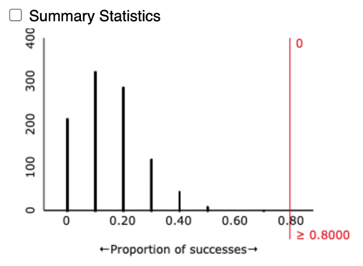
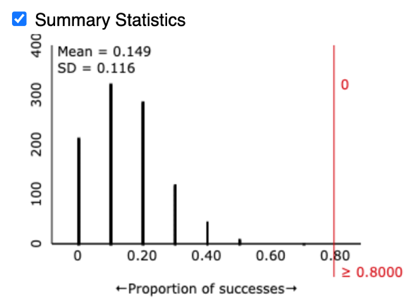
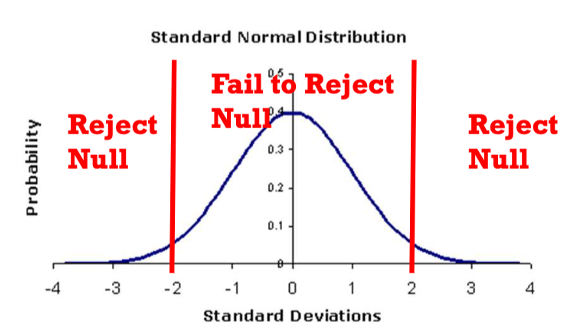
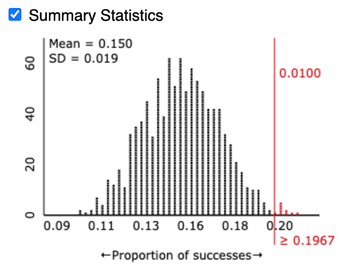

## Section 1.3 Learning Objectives {.center}

-   Be able to find and interpret a standardized statistic based on the observed number of successes.

-   Draw conclusions on the null hypothesis based on the magnitude of the standardized statistic.

# Review

## Wait, what is it we're trying to do? {.center}

**Goal:** Test if we have evidence in favor of our research question.

-   To do this, we design a study

-   We collect and test our data

## Hypothesis Testing Review {.center}

-   Hypotheses refine our research question

-   Give us a precise idea of what we want to test

-   We have two hypotheses:

    -   Null hypothesis
    -   Alternative hypothesis

## Hypothesis Testing Review {.center}

-   Null hypothesis ($H_{0}$):

    -   The chance explanation.
    -   What we assume is true

. . .

-   Alternative hypothesis ($H_{A}$):

    -   What researchers think could be true.
    -   There's an underlying cause.

. . .

We can either write our hypotheses in words or symbols.

## P-value Review {.center}

Once we have our hypotheses, we can test them.

-   P-value gives the probability of $\hat{p}$ occurring *if we assume* $H_{0}$ is true

. . .

We go by the following rules:

-   If p-value \> .05, fail to reject the null

-   If p-value ≤ .05, reject the null, accept alternative

Then we interpret our results based on the context of the problem.

## However, p-values are just one way we can test for statistical significance! {.center}

# Heart Transplant Example

## Key Information {.center style="font-size: 30px"}

::::: columns
::: {.column width="60%"}
-   St. George's Hospital in London noticed an increased mortality rate after heart transplants

-   Of last 10 heart transplants, 80% died within 30 days of surgery

-   Historical data reports the normal mortality rate as 15%

-   Want to investigate if St. George exceeds the national rate
:::

::: {.column width="40%"}
{fig-alt="Art of a human heart."}
:::
:::::

## Heart Transplant Example {style="font-size: 32px"}

::::: columns
::: {.column width="60%"}
Let's identify the following:

-   Research question

-   Observational units

-   Variable of interest

    -   Categorical or Numerical?

-   Parameter ($\pi$)

-   Observed statistic ($\hat{p}$)

-   Hypotheses (in symbols)
:::

::: {.column width="40%"}
+-------------------------------------------------------------------------------+
| Key Information                                                               |
+===============================================================================+
| -   80% of 10 transplants resulted in deaths within 30 days of the transplant |
|                                                                               |
| -   Historical data suggests a 15% mortality rate                             |
+-------------------------------------------------------------------------------+
:::
:::::

## Heart Transplant Example {style="font-size: 32px"}

Let's identify the following:

-   Research question: [**Is St. George's mortality rate for heart transplants higher than the national average?**]{.fragment}

-   Observational units: [**Each heart transplant (n=10)**]{.fragment}

-   Variable of interest: [**Live or die**]{.fragment}

    -   Categorical or Numerical? [**Categorical**]{.fragment}

-   Parameter ($\pi$): [**Long run proportion of patients who die within 30 days of a heart transplant at St. George.**]{.fragment}

-   Observed statistic ($\hat{p}$): [**8/10 = 80%**]{.fragment}

-   Hypotheses (in symbols):

    -   [$H_{0}$: $\pi$ = 0.15]{.fragment}
    -   [$H_{A}$: $\pi$ > 0.15]{.fragment}

## Heart Transplant Example: P-value

Let's find the p-value!

-   Open up the One Proportion Applet

    -   [Link to One Proportion Applet](https://www.isi-stats.com/isi2nd/ISIapplets2020.html)

-   Enter data from previous slides

-   Run simulation 1000 times

-   Find p-value

    -   Here, the p-value is the number of simulated values under the null hypothesis that are \_\_\_\_ than \_\_\_\_.

## Heart Transplant Example: P-value

Hopefully, you got something that looks like this.

{fig-alt="Null distribution that peaks at 0.15. A red line is drawn at 0.8." fig-align="center"}

Should we accept or reject the null?

-   P-value = 0 ?

# Standardized Statistic Method

## Standardized Statistic Method {.center}

-   A second method for determining strength of evidence

-   Standardizes $\hat{p}$ to a **standard normal distribution**

-   **Standard normal distribution** = Normal distribution with mean of 0 and standard deviation of 1

## Standard Deviation {.center}

Measure of how spread out data points are from the center.

## Standardized Statistic {.center}

How many standard deviations an observed statistic is from the mean of the null distribution; denoted by $z$

## Calculating the Standardized Statistic {.center}

$$z=\frac{Observed\: Statistic - Hypothesized\: Value}{Standard\: Deviation\: under\: the\: null}$$

## Calculating the Standardized Statistic {.center}

Can alternatively be written as:

$$z=\frac{Observed\: Statistic - Mean\: under\: the\: null}{Standard\: Deviation\: under\: the\: null}$$

Note: "Hypothesized value" and "mean under the null" refer to the same value

## Standardized Statistic {.center}

-   $z$ can be negative OR positive
-   $z$ represents the number of standard deviations the observed statistic is from the mean of the null distribution
-   The higher the absolute value of $z$ is, the more evidence we have in favor of $H_{A}$
-   Absolute value =
    -   Positive values stay the same
    -   Negative values become their positive counterpart

## Standard Deviation (S.D.) Formula {.center}

$$\sigma = \sqrt{\frac{\sum_{i=0}^n (x_{i}-\bar{x})^2}{n}}$$

Thankfully, you won't need to know this formula for this course, but some of you might find it nice to know how this number is calculated.

-   Instead, we can get our s.d. using the Applet. (Phew!)

## Obtaining Standard Deviation {.center}

Check "summary statistics" box to obtain the S.D.

{fig-alt="Null distribution that peaks at 0.15. A red line is drawn at 0.8. 'Summary Statistics' box is checked." fig-align="center"}

Note: Your s.d. won't be the same every time. How come?

## Heart Transplant Example {.center}

-   Observed statistic ($\hat{p}$) = 0.8
-   Hypothesized value ($\pi$) = 0.15
-   Standard Deviation under the null = 0.116 (from previous slide)

$$z=\frac{0.8 - 0.15}{0.116}=5.60$$

Cool, but what does this tell us?

## Evidence Based on the Standardized Statistic {.center}

-   Like the p-value, we have criteria for rejecting or failing to reject the null based on the standardized statistic (s.s.)

-   Reject $H_{0}$ when the s.s. is below -2 or above 2

-   "Outside the twos"

## Evidence Based on the Standardized Statistic {.center}

| Standardized Statistic  | Evidence Against Null |
|:------------------------|:---------------------:|
| Between -1.5 and 1.5    |       Not much        |
| Below -1.5 or above 1.5 |       Moderate        |
| **Below -2 or above 2** |      **Strong**       |
| **Below -3 or above 3** |    **Very strong**    |

## Evidence Based on the Standardized Statistic {.center}

{fig-alt="Standard normal distribution with red lines at -2 and 2 on the x axis, dividing the distribution into three zones. The middle zone says 'fail to reject null' and the outer zones say 'reject null'." fig-align="center"}

## Heart Transplant Example: New Data {.center}

Now say we collected more data.

::: incremental
-   Data from 361 heart transplants

-   71 people died within 30 days of surgery

-   $\hat{p}=\frac{71}{361}$
:::

## Heart Transplant Example: New Data {.center}

New simulation:

{fig-alt="Simulated null distribution with a red line at 0.1967 on the x axis. The distribution mean is 0.15 and standard deviation of 0.019." fig-align="center"}

Note that our p-value is still significant.

## Heart Transplant Example: New Data {.center}

-   New observed statistic: $\hat{p}=\frac{71}{361}=0.1967$
-   Hypothesized value ($\pi$) = 0.15
    
    -   This doesn't change!
    
-   Standard Deviation under the null = 0.019

$$z=\frac{0.1967 - 0.15}{0.019}=2.45$$

## Comparing the two scenarios {.center}

|           | Scenario 1  | Scenario 2  |
|:----------|:-----------:|:-----------:|
| $\hat{p}$ |    0.80     |   0.1967    |
| p-value   | $\approx$ 0 |    0.01     |
| $z$       |    5.60     |    2.45     |
| Outcome   | Reject null | Reject null |

## Comparing the two scenarios {.center}

|           | **Scenario 1**  | Scenario 2  |
|:----------|:---------------:|:-----------:|
| $\hat{p}$ |    **0.80**     |   0.1967    |
| p-value   | $\approx$ **0** |    0.01     |
| $z$       |    **5.60**     |    2.45     |
| Outcome   | **Reject null** | Reject null |

. . .

We reject the null in both scenarios, but in scenario 1 we have stronger evidence.

## Method comparison {.center}

 

|                        |                         |
|:----------------------:|:-----------------------:|
|       **Method**       | **When to Reject Null** |
|        P-value         |     p-value ≤ 0.05      |
| Standardized Statistic |  $z$ \> 2 or $z$ \< -2  |

 

-   Reject null = evidence to conclude alternative
-   Otherwise, we fail to reject the null
