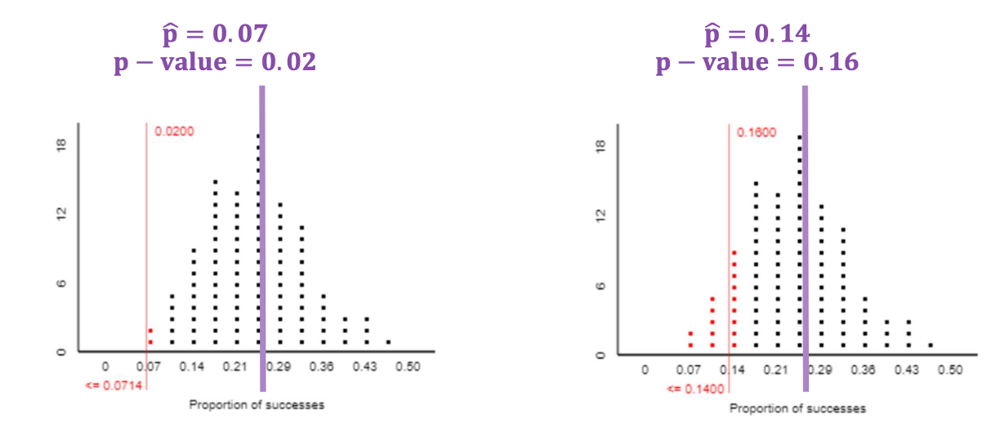
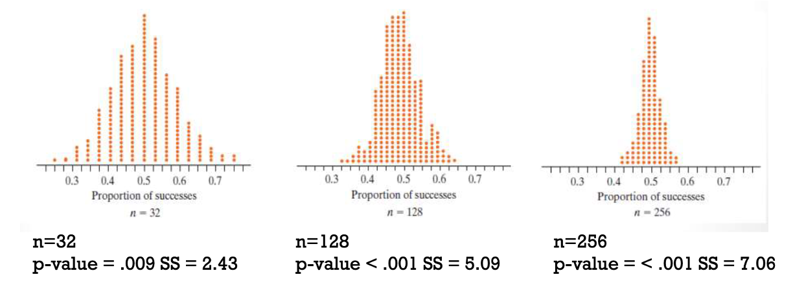

## Section 1.4 Learning Objectives {.center}

-   Understand how and why certain factors affect the p-value.

-   Recognize when to use a two-sided hypothesis test.

## Hypothesis Testing Review

-   Hypotheses refine our research question

-   We have two hypotheses:

    -   Null hypothesis = what is believed to be true
    -   Alternative hypothesis = what we think is *actually* true

-   Notation:

    -   $H_{0}: \pi = hypothesized\: value$
    -   $H_{A}: \pi >,<,≠ hypothesized\: value$

## P-value Review {.center}

-   Tests for evidence in favor of $H_{A}$
-   Gives probability of observed statistic ($\hat{p}$) under null hypothesis
-   Calculating the p-value:
    -   Count the \# of simulated statistics as or more extreme than $\hat{p}$ in the direction of the null hypothesis
    -   Divide by total number of simulated statistics

## P-value Review {.center}

-   If p-value \> .05, fail to reject the null
-   If p-value ≤ .05, reject the null, accept alternative
-   Interpret based on context

## Standardized Statistic Review {.center}

-   Another way to test for strength of evidence in favor of $H_{A}$
-   Obtain the standard deviation (SD)
-   Calculate the standardized statistic ($z$) by:

$$z=\frac{Observed\: Statistic - Hypothesized\: Value}{Standard\: Deviation\: under\: the\: null}$$

## Standardized Statistic Review {.center}

-   If $z$ \> 2 or $z$ \< -2, reject the null, accept alternative
-   Interpret based on context of the problem

# What can impact strength of evidence?

##  {.center}

-   We always want stronger evidence against the null
-   Smaller p-value = stronger evidence
-   Larger standardized statistic absolute value = stronger evidence

## Factors that impact evidence strength {.center}

1.  Distance between observed statistic & null value
2.  Sample size (n)
3.  One-sided or two-sided hypothesis test

## 1. Distance from the null value {.center}

**Recall:** The null value is what we expect based on chance alone

-   Is the center of the null distribution

## 1. Distance from the null value {.center}

Consider $\hat{p}$.

-   Further from null value = less likely null value is plausible
    -   P-value is smaller, standardized statistic absolute value is larger
-   Closer to the null value = more likely null value is plausible
    -   P-value is larger, standardized statistic absolute value is smaller

## 1. Distance from the null value {.center}

{fig-alt="Two null distributions with different values for p-hat. P-hat on the right is closer to the null, resulting in a larger p-value." fig-align="center"}

## 2. Sample Size {.center}

-   Increasing sample size increases strength of evidence
-   Decreasing sample size decreases strength of evidence

## 2. Sample Size {.center}

{fig-alt="Distributions with different sample sizes and values indicating more strength of evidence as sample size increases." fig-align="center"}

## 3. One-sided or two-sided hypothesis test {.center}

One-sided test:

-   Researchers think observed data will be greater than/less than the null model

Two-sided test:

-   Researchers don’t know; just looking for a difference

## 3. One-sided or two-sided hypothesis test

One-sided or two-sided refers to the form $H_{A}$ takes.

-   One-sided test takes the form:

$$H_{A}: \pi > OR < hypothesized\: value$$

-   Two-sided test takes the form:

$$H_{A}: \pi ≠ hypothesized\: value$$
