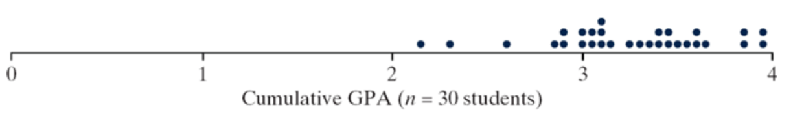
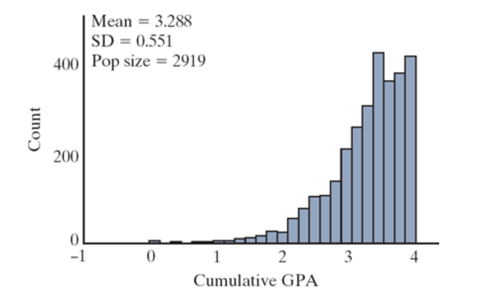
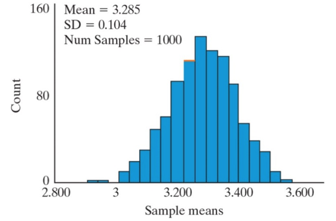

## Up until now... {.center}

-   We have been working with proportions
    -   We use proportions for **categorical (qualitative) data**
-   What if our data is qualitative (numerical)?

Examples: Height, weight, time, measurement of length

# Distributions

Recall: Describing a distribution

## Shape {.center}

Symmetric, mound-shaped, skewed? How many ”peaks”?

## Center {.center}

Where does the center of the pattern appear?

-   Generally refers to mean or mode

## Variability {.center}

How spread out is the distribution?

-   Generally described in terms of [**standard deviation**]{.underline}
-   Variability will be a big topic in this class!

## Unusual Data {.center}

-   Outliers
-   Outliers can affect results- so we need to be aware of them.

## Example Data Distribution {.center}

{fig-alt="Dot plot distribution of Cumulative GPA data from a sample of size 30." fig-align="center"}

## What's the difference? {.center}

::::: columns
::: {.column width="50%"}
{fig-alt="Histogram of cumulative GPA that is skewed left. Mean is 3.288, standard deviation is 0.551, and sample size is 2919." fig-align="center"}
:::

::: {.column width="50%"}
{fig-alt="A centered histogram of simulated sample means with a mean of 3.285 and standard deviation of 0.104." fig-align="center"}
:::
:::::

## Data Distribution {.center}

::::: columns
::: {.column width="50%"}
{fig-alt="Histogram of cumulative GPA that is skewed left. Mean is 3.288, standard deviation is 0.551, and sample size is 2919." fig-align="center"}
:::

::: {.column width="50%"}
-   This is data from a study

-   Then, we plot it

-   Here a histogram is used

    -   Could use other vices: dot plot, box plot, etc.
:::
:::::

## Sampling Distribution {.center}

::::: columns
::: {.column width="50%"}
{fig-alt="A centered histogram of simulated sample means with a mean of 3.285 and standard deviation of 0.104." fig-align="center"}
:::

::: {.column width="50%"}
-   Each data point represents one simulation of our study

-   The more simulations the better!

-   Generally, this is best plotted using a histogram or dot plot.
:::
:::::

## Summary Statistics {.center}

Sometimes it is helpful to summarize quantitative data with numerical values

## Mean {.center}

Add up all the values and divide by the total number of values

## Median

Half of the data is above the middle, half of the data is below the middle.

-   "Middle" is found when the data is ordered from lowest to highest

## Outliers

Unusual data points

-   Easy to pick out using visualizations

-   Can be found if the data is ordered too

    -   "Eyeballing" it

## Mean and Median Example {.center}

  Suppose we observe the following data:

|     |     |     |     |     |     |     |     |
|:---:|:---:|:---:|:---:|:---:|:---:|:---:|:---:|
|  8  | 10  | 11  | 12  | 15  |  7  |  8  |  9  |

 

-   Mean: **10**

-   Median: **9.5**

# Type I and Type II Errors

## Time for a detour... {.center}

Recall our hypotheses

-   $H_{0}$: What's expected to happen; chance explanation

-   $H_{A}$: Wait, something different happened!

## Time for a detour... {.center}

We want strength of evidence in favor of $H_{A}$

-   So far, we have two methods to obtain strength of evidence:

    -   [**Standardized statistic**]{.underline}

    -   [**P-value**]{.underline}

But, what happens if these methods are wrong?

## Time for a detour... {.center}

-   P-value:

    -   Derived using simulation or theory
    -   Based on the null model (random chance), so it could be wrong

-   Standardized statistic:

    -   Calculated using hypothesized null value
    -   Again, based on null model and could be wrong

. . .

Goes back to the idea of random chance!

## Buzz and Doris {.center}

Recall the Buzz and Doris example. (Investigating if dolphins can communicate.)    Hypotheses:

-   **Null:** Buzz is just guessing (50% chance of guessing correctly)

-   **Alt:** Buzz is communicating with Doris (Greater than 50% chance of guessing correctly.)

## Buzz and Doris {.center}

In this context, what does it mean if...

-   We reject the null hypothesis

-   We fail to reject the null hypothesis

## Type I Error {.center}

-   We reject the null hypothesis, but it is actually true
-   "False alarm"
-   In the Buzz and Doris example:
    -   We conclude that Buzz is communicating with Doris, but he is guessing

## Type II Error {.center}

-   We fail to reject the null hypothesis, but it is actually false
-   "Missed opportunity"
-   In the Buzz and Doris example:
    -   We conclude that Buzz is just guessing, but really, he is communicating with Doris

## The Boy Who Cried Wolf {.center}

Let's look at an example using the classic fairy tale:    Null: There is no wolf

Alt: There is a wolf

## The Boy Who Cried Wolf {.center}

-   Rejecting the null means there is a wolf, the boy cries wolf and the villagers believe there is a wolf

-   Failing to reject the null means there is no wolf, the boy does not cry wolf and the villagers believe there is no wolf

## The Boy Who Cried Wolf {.center}

-   **Type I Error:** The boy cries wolf and the villagers believe him, but there is no wolf.

-   **Type II Error:** The boy does not cry wolf and the villagers believe him, but there's actually a wolf.

::: notes
Draw a punnett square here
:::

## Implications of Errors {.center}

What does it mean when we make an error?

-   If a Type I Error is made:

    -   We're claiming we have a significant result, when we don't

-   If a Type II Error is made:

    -   We have missed a potentially important result

## Which type of error is worse? {.center}

Well, it depends!

-   Context is everything

-   Depending on the scenario, one error might be worse to have than the other

-   Sometimes neither error is the "end of the world"

# Heart Transplant Example (Revisited)

## Heart Transplant Example {.center}

-   80% of 10 transplants resulted in deaths within 30 days of the transplant

-   Historical data suggests a 15% mortality rate

## Heart Transplant Example {.center}

-   Null: The long run proportion of patients at St. George who die after receiving a heart transplant is greater than 15%

-   Alt: The long run proportion of patients at St. George who die after receiving a heart transplant is greater than 15%

. . .

What does it mean to reject the null?

. . .

What does it mean to fail to reject the null?

## Heart Transplant Example

::: incremental
-   What is the consequence of a Type I Error?

-   What is the consequence of a Type II Error?
:::
