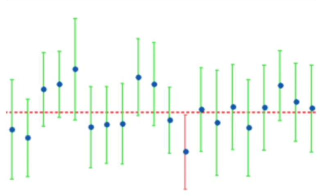

## Section 3.1 Learning Objectives {.center}

-   Calculate a range of plausible values for the population parameter based on a series of two-sided hypothesis tests where different null hypothesis values are tested.

-   Be able to interpret a confidence interval in the context of a problem, and understand what it represents.

## Recap {.center}

Interested in determining if a value for the parameter is [plausible]{.underline}.

-   Parameter = long run proportion OR long run mean

-   Set up hypothesis test

-   Use a method to determine strength of evidence:

    ::: incremental
    -   P-value
    -   Standardized statistic
    :::
-   Can use theory-based approach to find either

## Recap {.center}

-   We don't know our parameter

    -   Difficult or impossible to obtain

-   Previous goal: Is this specific parameter value plausible?

-   New goal: *What range* of parameter values are plausible?

# Intro to Confidence Intervals

## Confidence Intervals {.center}

-   [**Confidence Interval:**]{.underline} A range of likely values for our parameter of interest

-   Helps us estimate the true value of $\mu$ or $\pi$

-   Remember: We don't know the true value of $\mu$ or $\pi$

## Hypothesis Testing Review {.center}

Example Hypotheses:

-   $H_{0}$: $\pi$ = 0.5
-   $H_{A}$: $\pi$ ≠ 0.5

Pi is **NOT** actually equal to 0.5!!

-   This is what we *hypothesize* pi is based on random chance

-   We use a p-value or standardized statistic to tell us if 0.5 is a plausible value for $\pi$ or not

## Hypothesis Testing Review {.center}

Example Hypotheses:

-   $H_{0}$: $\pi$ = 0.5
-   $H_{A}$: $\pi$ ≠ 0.5

Interpretation:

::: incremental
-   If we reject $H_{0}$, we're saying pi cannot be 0.5 (not plausible)
-   If we fail to reject $H_{0}$, we're saying pi could be 0.5 (plausible)
:::

# Example: Legalization of Medical Marijuana

## Scenario {.center}

In February of 2014, a Star Tribune Minnesota poll asked a random sample of adults in Minnesota, “Do you support or oppose legalizing marijuana for medical purposes in Minnesota?” Of the 800 adults surveyed, 408 (51%) answered that they would support this.

. . .

**We want to estimate the true proportion of adults that feel medical marijuana should be legalized.**

::: notes
Write questions from the next slide on the board
:::

## Legalizing Medical Marijuana {.center}

-   Population of Interest: [**All adults in Minnesota**]{.fragment}

-   Parameter of Interest: [$\pi$= **Long run proportion of Minnesota adults that feel marijuana should be legalized**]{.fragment}

-   Sample/sample size: [**n = 800 surveyed Minnesota adults**]{.fragment}

-   Observed Statistic: [$\hat{p}=\frac{408}{800}=0.51$]{.fragment}

. . .

Note: We may also refer to the observed statistic as a [**point estimation**]{.underline}

. . .

**What if we took a different sample of 800 adults?**

## Legalizing Medical Marijuana Activity {.center}

-   Use the **Theory Based Inference Applet**

-   Work with people around you to test different values of $\pi$

-   For each value of $\pi$ record:

    1.  P-value
    2.  Should you reject (R) or fail to reject (FTR) the null hypothesis?
    3.  Is the hypothesized value for $\pi$ plausible or not?

## Activity Results {style="font-size: 23px"}

|  |  |  |  |  |  |  |  |  |  |  |
|:-----:|:-----:|:-----:|:-----:|:-----:|:-----:|:-----:|:-----:|:-----:|:-----:|:-----:|
| $H_{0}:\pi=$ | 0.41 | 0.42 | 0.43 | 0.44 | 0.45 | 0.46 | 0.47 | 0.48 | 0.49 | 0.50 |
| **P-value** | \>0.0001 | \>0.0001 | \>0.0001 | 0.0001 | 0.0006 | 0.0045 | 0.0234 | 0.0894 | 0.2578 | 0.5716 |
| **R/FTR** | R | R | R | R | R | R | R | FTR | FTR | FTR |
| **Plausible?** | No | No | No | No | No | No | No | Yes | Yes | Yes |

  

|  |  |  |  |  |  |  |  |  |  |  |
|:-----:|:-----:|:-----:|:-----:|:-----:|:-----:|:-----:|:-----:|:-----:|:-----:|:-----:|
| $H_{0}:\pi=$ | 0.51 | 0.52 | 0.53 | 0.54 | 0.55 | 0.56 | 0.57 | 0.58 | 0.59 | 0.60 |
| **P-value** | 1 | 0.5713 | 0.2570 | 0.0887 | 0.0230 | 0.0044 | 0.0006 | 0.0001 | \>0.0001 | \>0.0001 |
| **R/FTR** | FTR | FTR | FTR | FTR | R | R | R | R | R | R |
| **Plausible?** | Yes | Yes | Yes | Yes | No | No | No | No | No | No |

 

-   What trends do you notice?
-   What is our range of plausible values?

## Confidence Interval Interpretation {.center}

-   0.48 to 0.54 is also known as our confidence interval!

    -   Can be written as (0.48, 0.54)

-   We are 95% confident that the true value of $\pi$ is between 0.48 and 0.54

    -   This is a general interpretation
    -   Put this in context of the given problem

. . .

"We are 95% confident that the long-run proportion of Minnesota adults who feel medical marijuana should be legalized is between 0.48 and 0.54."

## Confidence Intervals: General Form {.center style="text-align: center;"}

  Confidence Interval (CI) = (Lower Bound, Upper Bound)

= Observed statistic ± margin of error

## Medical Marijuana Example {.center}

-   $\hat{p}$ = 0.51
-   CI = (0.48, 0.54)
-   Alternatively, could write: 0.51 ± 0.03

{fig-alt="Article snippet: The poll surveyed 800 Minnesota adults between Feb. 10 and 12 and has a margin of sampling error of plus or minus 3.5 percentage points." fig-align="center"}

# Significance Levels

## Significance Level {.center}

P-value cutoff for rejecting/failing to reject the null

-   Denoted by $\alpha$

-   More "mathematical" reason we reject $H_{0}$ if p-value is less than 0.05

-   Significance level + confidence level = 100%

## Common Significance Levels: $\alpha$ = 0.10 {.center}

-   90% confidence level

-   Reject when p-value \< 0.10

-   Reject null more often

-   Narrower confidence interval

-   More Type I errors, less Type II errors

## Common Significance Levels: $\alpha$ = 0.05 {.center}

-   95% confidence level

-   Reject when p-value \< 0.05

-   Standard Practice

## Common Significance Levels: $\alpha$ = 0.01 {.center}

-   99% confidence level

-   Reject when p-value \< 0.01

-   Reject null less often

-   Wider confidence interval

-   Less Type I errors, more Type II errors

## Confidence Level {.center}

Percent of samples expected to generate a confidence interval containing the true parameter.

-   Recall: the confidence interval generated is based on the observed statistic!

## Confidence Level {.center}

Ex: 95% confidence level

-   If we sampled from the same population 20 times, we would expect 19 (95%)  confidence intervals calculated based on the samples to contain the true population parameter

## Confidence Level {.center}

{fig-alt="Graphic depicting the concept of confidence level." fig-align="center"}

## General Confidence Interval Interpretation {.center}

"We are (confidence level)% confident that the (problem context) is between (lower bound) and (upper bound)."
