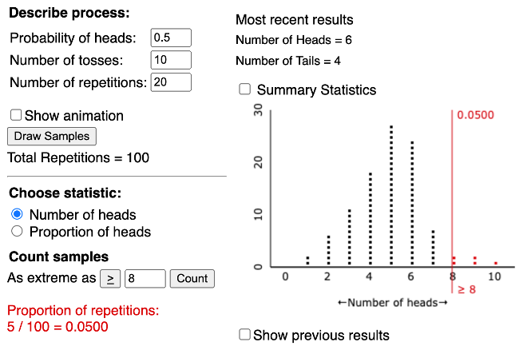

## Section 3.2 Learning Objectives {.center}

-   Compute and write a confidence interval in terms of a center point plus or minus the margin of error.

-   Calculate a confidence interval for a single proportion using the 2SD method and the theory-based approach.

# Review

## Confidence Intervals {.center}

Give us a range of likely values for our parameter ($\mu$ or $\pi$)

-   True parameter is never known!!!

-   But, we get an idea of what it might be

## Confidence Intervals: General Form {.center style="text-align: center;"}

  Confidence Interval (CI) = (Lower Bound, Upper Bound)

= Observed statistic ± margin of error

-   Margin of Error = Multiplier \* Standard Error

## Null Distribution and Hypothesis Testing {.center}

-   [**Null distribution**]{.underline}: Simulated by the chance model

    -   What we *expect* to happen

-   Center of null distribution is our hypothesized value for our parameter of interest ($\mu$ or $\pi$)

Example Hypotheses:

-   $H_{0}$: $\pi$ = 0.5
-   $H_{A}$: $\pi$ ≠ 0.5

## P-value {.center}

Number of simulated statistics in the null distribution that are [as or more extreme than what we observed in real life]{.underline}

-   P-value is essentially a percentage

-   Since our goal is to reject our null hypothesis, we want this percentage to be low!

## Example Null Distribution

{fig-alt="Null distribution with 100 simulated statistics. Each statistic represents the number of heads in 10 coin flips. The distribution is centered around 5, and the probability of heads (hypothesized value) is 0.5. The p-value is 0.05, or 5/100 simulated statistics being greater than or equal to our observed statistic." fig-align="center"}

## Medical Marijuana Activity {.center style="font-size: 22px"}

|  |  |  |  |  |  |  |  |  |  |  |
|:-----:|:-----:|:-----:|:-----:|:-----:|:-----:|:-----:|:-----:|:-----:|:-----:|:-----:|
| $H_{0}:\pi=$ | 0.41 | 0.42 | 0.43 | 0.44 | 0.45 | 0.46 | 0.47 | 0.48 | 0.49 | 0.50 |
| **P-value** | \>0.0001 | \>0.0001 | \>0.0001 | 0.0001 | 0.0006 | 0.0045 | 0.0234 | 0.0894 | 0.2578 | 0.5716 |
| **R/FTR** | R | R | R | R | R | R | R | FTR | FTR | FTR |
| **Plausible?** | No | No | No | No | No | No | No | Yes | Yes | Yes |

  

|  |  |  |  |  |  |  |  |  |  |  |
|:-----:|:-----:|:-----:|:-----:|:-----:|:-----:|:-----:|:-----:|:-----:|:-----:|:-----:|
| $H_{0}:\pi=$ | 0.51 | 0.52 | 0.53 | 0.54 | 0.55 | 0.56 | 0.57 | 0.58 | 0.59 | 0.60 |
| **P-value** | 1 | 0.5713 | 0.2570 | 0.0887 | 0.0230 | 0.0044 | 0.0006 | 0.0001 | \>0.0001 | \>0.0001 |
| **R/FTR** | FTR | FTR | FTR | FTR | R | R | R | R | R | R |
| **Plausible?** | Yes | Yes | Yes | Yes | No | No | No | No | No | No |

## Medical Marijuana Example {.center}

-   Essentially we ran 20 different hypothesis tests of the form:

    -   $H_{0}$: $\pi$ = x
    -   $H_{A}$: $\pi$ ≠ x

-   Our confidence interval is derived based on the tests we rejected or failed to reject $H_{0}$

    -   Reject $H_{0}$ = not a plausible value for $\pi$
    -   Fail to reject $H_{0}$ = a plausible value for $\pi$

## How does significance level affect things? {.center style="font-size: 22px"}

|  |  |  |  |  |  |  |  |  |  |  |
|:-----:|:-----:|:-----:|:-----:|:-----:|:-----:|:-----:|:-----:|:-----:|:-----:|:-----:|
| $H_{0}:\pi=$ | 0.41 | 0.42 | 0.43 | 0.44 | 0.45 | 0.46 | 0.47 | 0.48 | 0.49 | 0.50 |
| **P-value** | \>0.0001 | \>0.0001 | \>0.0001 | 0.0001 | 0.0006 | 0.0045 | 0.0234 | 0.0894 | 0.2578 | 0.5716 |

  

|  |  |  |  |  |  |  |  |  |  |  |
|:-----:|:-----:|:-----:|:-----:|:-----:|:-----:|:-----:|:-----:|:-----:|:-----:|:-----:|
| $H_{0}:\pi=$ | 0.51 | 0.52 | 0.53 | 0.54 | 0.55 | 0.56 | 0.57 | 0.58 | 0.59 | 0.60 |
| **P-value** | 1 | 0.5713 | 0.2570 | 0.0887 | 0.0230 | 0.0044 | 0.0006 | 0.0001 | \>0.0001 | \>0.0001 |

 

::: incremental
-   $\alpha=0.01$: CI = (0.47,0.55)
-   $\alpha=0.05$: CI = (0.48,0.54)
-   $\alpha=0.10$: CI = (0.49,0.53)
:::

# 2SD Confidence Interval Approach

## 2SD Confidence Intervals for Proportions {.center}

Standard error for proportions:

$$SE=\sqrt{\frac{\hat{p}*(1-\hat{p})}{n}}$$ For a 95% confidence interval, multiplier = 2

## 2SD Confidence Intervals for Proportions {.center}

By plugging those values into our general confidence interval formula, we get:

$$CI=\hat{p}±2*\sqrt{\frac{\hat{p}*(1-\hat{p})}{n}}$$

$$=(Lower\:Bound,Upper\:Bound)$$

Check that theory-based criteria are met:

-   At least 10 successes and 10 failures

## Standard Deviation vs. Standard Error {.center}

-   **Standard deviation (SD)** is how much a data point is likely to vary from the mean of the data

-   We can also obtain SD for our null distribution

    -   This is standard error!
    
-   **Standard error (SE)** is how much a sample proportion (or mean) is likely to vary from the true population proportion (or mean)

    -   Formulas for standard error differ for numerical vs. categorical data

# Medical Marijuana Example

## Calculating a 2SD Confidence Interval {.center}

::: incremental
-   $\hat{p}=\frac{408}{800}=0.51$
-   $n=800$
-   $SE=\sqrt{\frac{\hat{p}*(1-\hat{p})}{n}}=\sqrt{\frac{0.51*(1-0.51)}{800}}=0.0177$
-   $CI=\hat{p}±2*SE=0.51±2*0.0177$
-   Lower Bound: $0.51-2*0.0177=0.47$
-   Upper Bound: $0.51+2*0.0177=0.55$
:::

. . .

Note that this is really close to what we got earlier!

## Interpreting a Confidence Interval {.center}

"We are 95% confident that the long run proportion of (context) falls between (lower bound) and (upper bound)."

. . .

Here we are not concluding anything! We're simply *interpreting* what the confidence interval means.

## Conclusions from a Confidence Interval {.center}

-   If our null hypothesis value is OUTSIDE our confidence interval:

    -   Reject the null

    -   It's not a plausible value

-   If our null hypothesis is INSIDE the confidence interval:

    -   Fail to reject the null

    -   It's a plausible value

## Conclusions from a Confidence Interval {.center}

Conclusion in context:

-   “We (do/do not) have enough evidence to conclude (insert alt. hypothesis).”

## Legalization of Medical Marijuana {.center}

Research question: Do a majority of Minnesota adults feel medical marijuana should be legalized?

-   Majority = more than 50%

## Legalization of Medical Marijuana {.center}

Hypotheses:

-   $H_{0}$: $\pi$ = 0.5
-   $H_{A}$: $\pi$ ≠ 0.5

CI = (0.47, 0.55)

-   Fail to reject since 0.5 is in the interval

## Interpretation in Context {.center}

“We are 95% confident that the long run proportion of Minnesotan adults who support the legalization of medical marijuana is between 47% and 55%.”

## Conclusion in Context {.center}

“We do not have enough evidence to conclude that the long run proportion of Minnesotan adults who feel medical marijuana should be legalized is different from 0.50.”

# Methods for Determining Statistical Significance

## Recall... {.center}

-   **Rejecting** the null hypothesis means we have statistical significance in favor of $H_{A}$

-   **Failing to reject** the null hypothesis means we do not have statistical significance in favor of $H_{A}$

## 1. P-value {.center}

-   P-value \< 0.05: Reject the null hypothesis

-   P-value ≥ 0.05: Fail to reject the null hypothesis

## 2. Standardized Statistic (SS) {.center}

-   If SS is "outside the twos", reject the null hypothesis

-   If SS is "inside the twos", fail to reject the null hypothesis

## 3. Confidence Interval (CI) {.center}

-   If hypothesized value is outside the CI, reject the null hypothesis

-   If hypothesized value is inside the CI, fail to reject the null hypothesis

## All methods should agree with each other! {.center}
