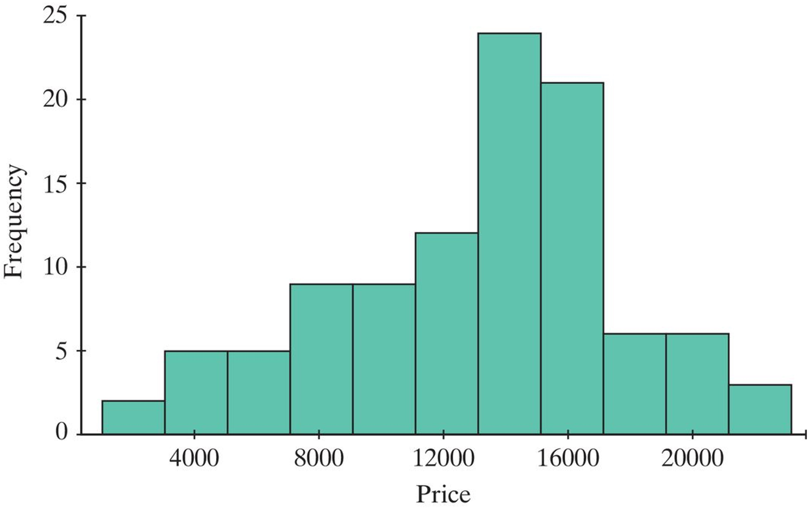

## Section 3.3 Learning Objectives {.center}

-   Calculate a confidence interval for a single mean using the 2SD method and the theory-based approach.

# Review

## Confidence Intervals {.center}

-   Gives us range of **plausible values** for our parameter of interest

    -   Either $\mu$ or $\pi$

## Confidence Intervals: General Form {.center style="text-align: center;"}

  Confidence Interval (CI) = (Lower Bound, Upper Bound)

  = Observed statistic ± Margin of Error

  Margin of Error = Multiplier \* Standard Error

## 2SD (95%) Confidence Interval for Proportions {.center}

$$CI=\hat{p}±2*\sqrt{\frac{\hat{p}*(1-\hat{p})}{n}}$$

$$=(Lower\:Bound,Upper\:Bound)$$

. . .

What do you think changes if we're dealing with a mean rather than a proportion?

# Confidence Intervals for Single Means

## Formulas {.center}

Standard error for means:

$$SE=\frac{s}{\sqrt{n}}$$

2SD (95%) Confidence Interval for Means:

$$CI=\bar{x}±2*\frac{s}{\sqrt{n}}$$

. . .

Why does it make sense that we use $\bar{x}$ now?

## Validity Conditions for Single Mean {.center}

We must meet the validity conditions for the theory-based approach:

-   Sample size ≥ 20

-   Distribution not strongly skewed

# Example

## Used Hondas

::::: columns
::: {.column width="60%"}
  {fig-alt="Histogram of price data for 102 used Honda Civics. Bins range from 2000 to 22000 and peak around 14000. The distribution is not strongly skewed."}
:::

::: {.column width="40%"}
Price data from a random sample of 102 used Honda Civics for sale on the internet is displayed on the histogram. The sample mean of the data was \$13,292 with a standard deviation of \$4,535.
:::
:::::

. . .

Is the criteria met to use the confidence interval approach?

## Calculating the Confidence Interval {.center}

::: incremental
-   $\bar{x}=13292$
-   $n=102$
-   $s=4535$
-   $SE=\frac{s}{\sqrt{n}}=\frac{4535}{\sqrt{102}}=449.03$
-   $CI=\bar{x}±2*SE=13292±2*449.03$
-   Lower Bound: $13292-2*449.03=12393.94$
-   Upper Bound: $13292+2*449.03=14190.06$
:::

## Interpreting the Confidence Interval {.center}

“We are 95% confident that the long run mean of all used Honda Civics for sale on the internet is between \$12,393.94 and \$14,190.06.”

## Conclusions from a Confidence Interval {.center}

-   If our null hypothesis value is OUTSIDE our confidence interval:

    -   Reject the null

    -   It's not a plausible value

-   If our null hypothesis is INSIDE the confidence interval:

    -   Fail to reject the null

    -   It's a plausible value

. . .

Note that this example doesn't have a hypothesized value! We are simply interpreting the interval.

## Statistical Significance Methods {.center}

We can use the same three methods with a single mean:

1.  P-value

2.  Standardized Statistic

3.  Confidence Interval

. . .

Remember that all three methods will agree with each other!

-   All either reject or fail to reject $H_{0}$
