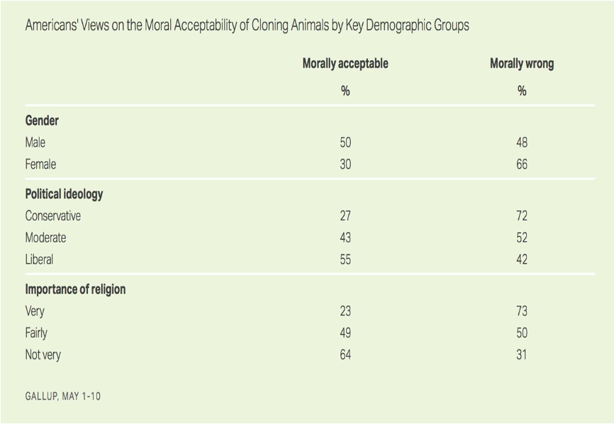
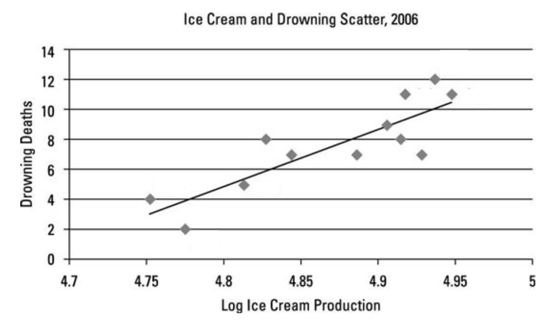
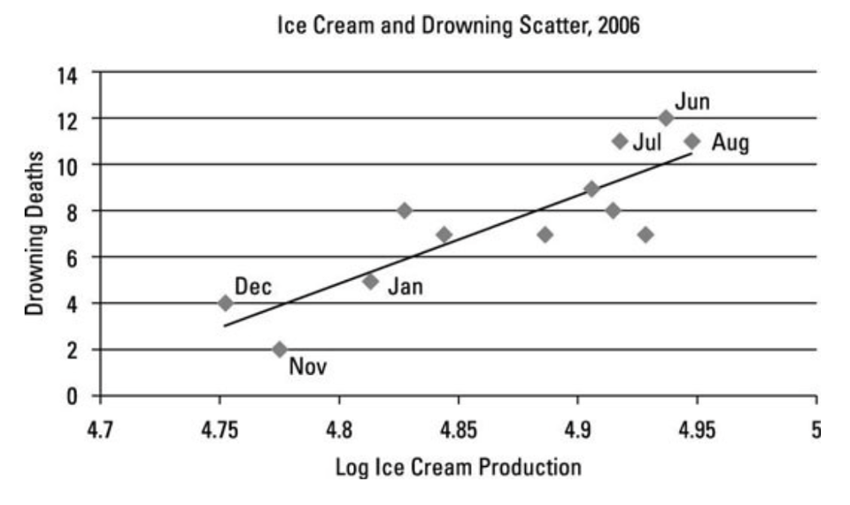
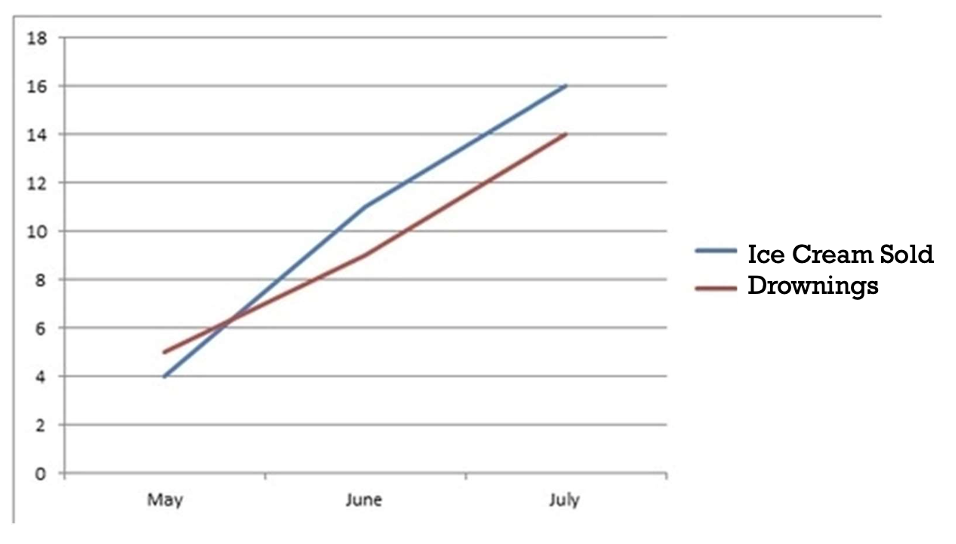

## Section 4.1 Learning Objectives {.center}

-   Understand and be able to calculate conditional proportions.

-   Be able to determine which variable is the explanatory variable and which is the response variable in a given context.

-   Understand what a confounding variable is and how it can affect association assumptions.

# Review

## Recap {.center}

-   Chapters P-3: Is there an effect? How big is the effect?

-   We do this by:

    1.  Asking a research question.
    2.  Setting up a hypothesis test.
    3.  Testing our hypothesis for **significance of evidence by**:
        -   P-value
        -   Standardized statistic
        -   Confidence intervals

# Comparing Two Groups

## Overview {.center}

Previously, research questions focused on one proportion or mean

-   What proportion of the time did Buzz choose the right button?

-   What is the average time of an Olympic bobsleigh team?

## Overview {.center}

Now, we want to compare two groups

-   Are smokers more likely than nonsmokers to develop lung cancer?

-   Are children who used night lights as infants more likely to need glasses than those who didn't use night lights?

# Variable Types

## Explanatory Variable (Independent Variable) {.center}

Variable we think is "explaining" the response variable.

-   Researchers manipulate this variable

## Response Variable (Dependent Variable) {.center}

Variable that is being impacted or changed by the explanatory variable.

-   "Depends on" or "responds to" the explanatory variable

## Example {.center}

We may think that if we eat and apple a day (explanatory variable) then we'll have to go to the doctor (response variable) less!

## Role of Variables Activity {.center}

For each of the variable pairs, identify which you think is the explanatory and which is the response

-   Smoking and lung cancer

-   Heart disease and diet

-   Exam score and hours studied

-   Vitamin C and colds

-   Hair color and eye color

## Associated Variables {.center}

[**Associated:**]{.underline} When one variable gives valuable information about the other

Ex:

-   Hours of studying before an exam could give information on how well you'll do

-   How many apples you eat could give information about how often you'll go to the doctor

## Cause and effect? {.center}

But, can we say that our explanatory variable *causes* our response variable? No!

-   **Association does NOT mean causation**
-   If you remember anything from this class, let it be this!!

## Confounding Variable {.center}

A variable that is related to both the explanatory variable and response variable in such a way that its effects cannot be separated from the effects of the explanatory.

## Using Proportions {.center}

-   Can we determine association using proportions?

Example (next slide):

-   Is political ideology associated with views on the moral acceptability of cloning animals?

-   What about the importance of religion?

## Cloning Animals

{fig-alt="Graphic breaking down the proportion of different demographics that believe cloning animals is morally acceptable versus morally wrong. Demographics include gender, political ideology, and importance of religion."}

# Example: Does ice cream cause drownings?

## Ice Cream Sold vs Drownings

{fig-alt="Scatter plot showing a positive trend between log ice cream production and deaths by drowning. Ice cream production is on the x axis and drownings are on the y axis." fig-align="center"}

## Ice Cream Sold vs Drownings

{fig-alt="Same figure as the previous slide, except now the dots are labeled with months, indicating that month is the confounding variable here. This is due to month having a correlation with both ice cream production and drowning deaths; more people swim during summer months, and more ice cream is bought and produced in summer months as well." fig-align="center"}

## Confounding Variable: Month

{fig-alt="Line chart showing a blue line that has a positive trend between month (x axis) and units of ice cream sold, and a red line showing a positive trend between month and number of deaths from drownings." fig-align="center"}

# Examples

## All-Nighters & GPAs {.center style="font-size: 36px"}

::::: columns
::: {.column width="60%"}
Claim:

Explanatory variable:

-   Categorical or quantitative?

Response variable:

-   Categorical or quantitative?

Potential confounding variable(s):
:::

::: {.column width="40%"}
| Scenario |
|:----------------------------------------------------------------------:|
| Researchers found that students who claim to have never pulled an all-nighter have an average GPA of 3.1, while students who have pulled an all-nighter have an average GPA of 2.9. |
:::
:::::

## All-Nighters & GPAs {.center}

-   Claim: [**All-nighters cause lower GPAs.**]{.fragment}

-   Explanatory variable: [**Pulling an all-nighter or not; Categorical**]{.fragment}

-   Response variable: [**GPA; Quantitative**]{.fragment}

-   Potential confounding variable(s):

## TV's & Lifespan {.center style="font-size: 36px"}

::::: columns
::: {.column width="60%"}
Claim:

Explanatory variable:

-   Categorical or quantitative?

Response variable:

-   Categorical or quantitative?

Potential confounding variable(s):
:::

::: {.column width="40%"}
| Scenario |
|:----------------------------------------------------------------------:|
| Researchers found that countries that have more TVs per 1000 people have a higher average lifespan. |
:::
:::::

## TV's & Lifespan {.center}

-   Claim: [**TVs increase lifespan.**]{.fragment}

-   Explanatory variable: [**Number of TVs per 1000 people; Quantitative**]{.fragment}

-   Response variable: [**Average lifespan; Quantitative**]{.fragment}

-   Potential confounding variable(s):
