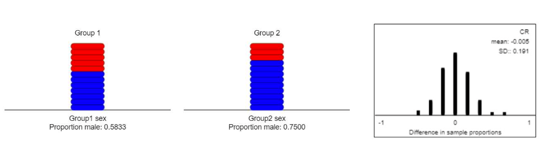
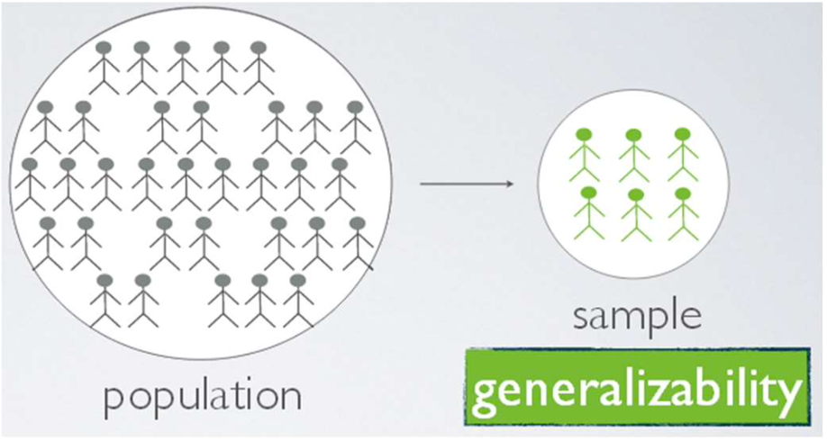
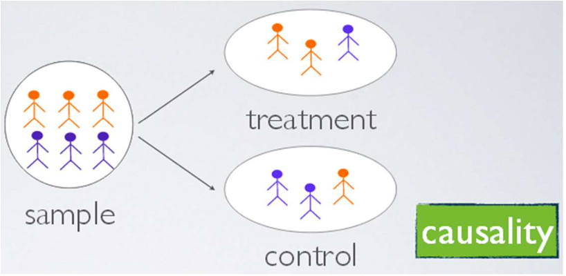
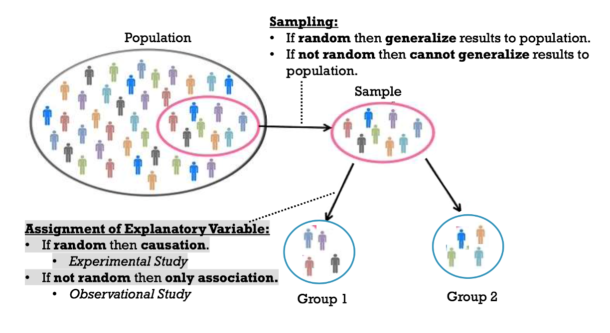

## Section 4.2 Learning Objectives {.center}

-   Determine if a study is observational or experimental.

-   Understand why random assignment allows for a cause and effect conclusion.

-   Determine whether a study used random assignment and/or random sampling and how each affects the conclusions that can be drawn.

# Review

## Variable Types {.center}

-   Explanatory (independent) variable

    -   "Explains" the response variable

-   Response (dependent) variable

    -   "Responds" to the explanatory variable

-   Confounding variable

    -   Related to both

-   Association does NOT mean causation

    -   There is always potential for a confounding variable

# Example

## Have a Nice Trip {.center}

An area of research in biomechanics and gerontology concerns falls and fall related injuries, especially for old people. Recent studies have focused on how individuals respond to large postural disturbances (like slipping or tripping). One question is whether subjects can be instructed to improve their recovery from such disturbances.

## Have a Nice Trip {.center}

Researchers want to compare two strategies:

-   **Lowering**: Quickly stepping down with the front leg and then raising the back leg over the object

-   **Elevating**: Lifting the front leg over the object

## Have a Nice Trip {.center}

24 subjects agreed to participate in a study:

-   8 Females

-   16 Males

## Have a Nice Trip {.center}

Identify the following:

-   Explanatory variable: [**Strategy used (lowering or elevating)**]{.fragment}

-   Response variable: [**Fall or not**]{.fragment}

-   Potential confounding variables

# Reducing Confounding Variables

## Intro {.center}

How do we reduce the risk of confounding variables?

-   Confounding variables add [bias]{.underline}

-   **Bias** = consistently over- or under-estimating the parameter of interest

Main ideas:

-   Observational studies vs experimental studies

-   Random sampling vs random assignment

## Observational Study {.center}

Comparing two groups that are "just there"

-   Observe subjects and collect their data

-   Researchers cannot manipulate anything

Examples:

::: incremental
-   Surveys

-   Teacher evaluations
:::

## Experimental Study {.center}

You choose the conditions for the [experimental units]{.underline}

-   Assign experimental units to groups

-   Researchers can manipulate

Examples:

::: incremental
-   Assign one group to a diet group and the other to an exercise program. Then measure the weight loss in each group

-   Students are told to listen to either country or classical music before an exam. Their exam results are compared.
:::

## Side note! {.center}

In experiments, we refer to observational units as experimental units!

## Example Scenario {.center}

Researchers want to set up an observational OR experimental study to answer the research question, “Does exercise help prevent against colds and the flu?”

::: incremental
-   How could we make this an observational study?

-   How could we make this an experimental study?
:::

## Randomized Experiment {.center}

-   Use a method of chance to assign experimental units to groups

-   This allows us to balance out confounding variables

-   Best way to avoid bias!

## Have a Nice Trip {.center}

-   Comparing **lowering** and **elevating** strategies for fall prevention

-   24 subjects: 8 females, 16 males

-   Explanatory variable: **Strategy used**

-   Response variable: **Fall or recover**

-   Potential confounding variable: **Gender**

## Have a Nice Trip {.center}

Researchers could assign females to the lowering strategy, and males to the elevating strategy.

. . .

-   Is this reasonable?

## Have a Nice Trip {.center}

-   Could assign half females and half males to each strategy

-   Then could we say gender is confounding?

-   Could a different variable still be confounding?

## Have a Nice Trip {.center}

-   There are always more confounding variables than we are aware of!

-   Need a method to decide who uses which strategy

-   Enter: Random assignment!

## Have a Nice Trip {.center}

Suppose we randomly draw 12 names from a hat to use the lowering strategy

-   What proportion would we expect to be male?

-   What about female?

-   Will males always have an 8 and 8 split? Or females 4 and 4?

-   [Randomizing Subjects Applet](https://www.isi-stats.com/isi2nd/ISIapplets2020.html)

## Have a Nice Trip {.center}

-   **Main idea:** Randomizing gives the best chance to even out ANY confounding variables

-   In theory, all confounding variables are equally distributed and should not be confounding

{fig-alt="Screenshot of \"Randomizing Subjects Applet\". Group 1 displays a proportion of 0.58 males, and group 2 displays a proportion of 0.75 males. A null distribution shows the average difference in proportion for males in each group is 0." fig-align="center"}

## Random Sampling vs Random Assignment {.center}

-   Not the same thing

-   Differently affect the conclusions we can make

## Random Sampling {.center}

Representative sample from a population

-   Allows us to extend conclusions to a larger population

## Random Sampling Visual {.center}

{fig-alt="Larger circle with stick figures labeled 'population'. Smaller circle with less stick figures labeled 'sample'. This implies we can generalize our results to the larger population." fig-align="center"}

::::: columns
::: {.column width="50%"}
Random sample:

-   Can generalize
:::

::: {.column width="50%"}
No random sample:

-   Cannot generalize
:::
:::::

## Random Assignment {.center}

Randomly produce similar groups

-   Allows us to claim a "cause and effect" relationship between the explanatory and response variables

## Random Sampling Visual {.center}

{fig-alt="Larger circle labeled 'sample' with 3 orange figures and 3 blue figures. Arrows point to two smaller cicles. One is labeled 'treatment' and has 2 orange figures and 1 blue figure. The other is labeled 'control' and has 2 blue figures and 1 orange figure." fig-align="center"}

::::: columns
::: {.column width="50%"}
Random assignment:

-   Experimental study

-   Can determine causation
:::

::: {.column width="50%"}
No random assignment:

-   Observational study

-   Can only determine association
:::
:::::

## Random Assignment vs Random Sampling Visual {.center}

{fig-alt="Diagram that combines the 'random assignment visual\" and \"random sample visual\". Graphic explains that if sampling is random then you can generalize your results to the population. If assignment is random, then causation can be determined. Otherwise, only association can be determined." fig-align="center"}

## Summary Table {.center style="font-size: 31px"}

|  |  |  |
|:----------------------:|:----------------------:|:----------------------:|
|  | **Random Assignment** | **No Random Assignment** |
| **Random Sampling** | Random sample from a population that is randomly assigned to groups (ideal!) | Random sample from a population that are already in pre-existing groups. (Smokers vs non-smokers survey.) |
| **No Random Sampling** | A group of study units is selected non-randomly from a population and randomly assigned to groups. (Splitting our class into random groups.) | Collections of available units from two distinct groups are examined. (Splitting our class into male and female groups.) |

## Summary Table {.center style="font-size: 32px"}

|  |  |  |
|:----------------------:|:----------------------:|:----------------------:|
|  | **Random Assignment** | **No Random Assignment** |
| **Random Sampling** | Can generalize to the population; Causation conclusion | Can generalize to the population; Association conclusion |
| **No Random Sampling** | Cannot generalize to the population; Causation conclusion | Cannot generalize to the population; Association conclusion |
