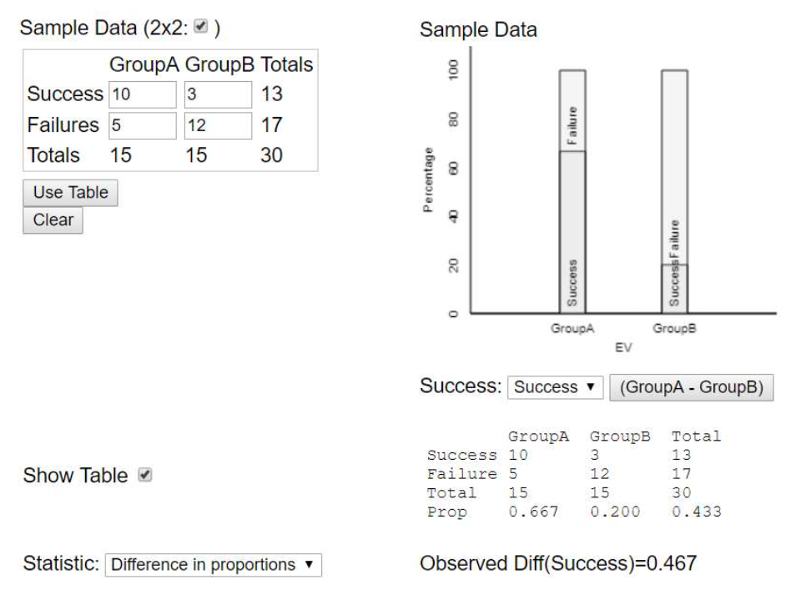
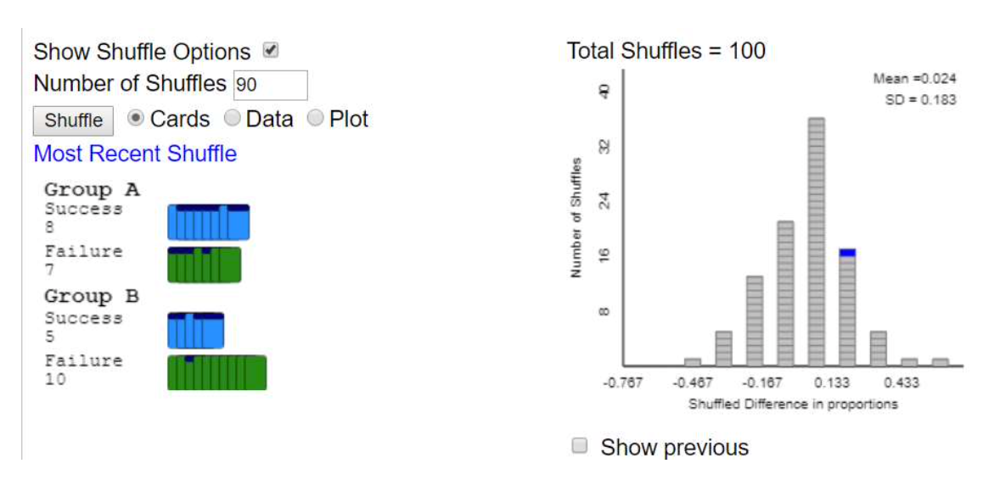
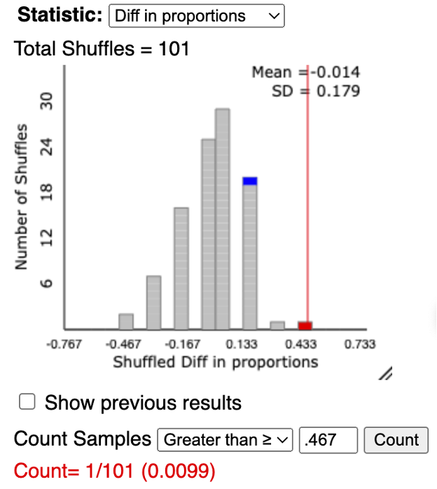

## Section 5.2 Learning Objectives {.center}

-   Know how to set up a null and alternative hypothesis comparing two levels of an explanatory variable when comparing two categorical variables

-   Find and interpret the standardized statistic and the p-value for a test of two proportions.

-   Use the 2SD method to calculate a 95% confidence interval for a difference in the long-run proportion of success for two treatment groups, and interpret what the interval means in the context of the problem.

## 3S Strategy: Statistic {.center}

First, we need a statistic. What is it that we're interested in?

-   [**Parameter:**]{.underline} The difference in long run proportions between two groups

    -   $\pi_{Group\:1} - \pi_{Group\:2}$

. . .

-   [**Observed Statistic:**]{.underline} The difference in conditional proportions

    -   $\hat{p}_{Group\:1} - \hat{p}_{Group\:2}$

## 3S Strategy: Simulate & Strength of Evidence {.center}

Next, we simulate to gather strength of evidence in favor of $H_A$

-   Null Hypothesis: There is no difference between the long run proportions of two groups

-   Alt. Hypothesis: There is a difference between the long run proportions of two groups

## 3S Strategy: Simulate & Strength of Evidence {.center}

In symbols:

-   $H_0: \pi_{Group\:1} - \pi_{Group\:2} = 0$

-   $H_A: \pi_{Group\:1} - \pi_{Group\:2} >,<,\neq 0$

# Example

## Swimming with Dolphins {.center}

Researchers wanted to study the effects of dolphins on people with depression. 30 participants were split into two groups: a group that swam with dolphins, and another group that swam without. Afterwards it was recorded whether or not each person noticed an improvement in their depression symptoms.

## Swimming with Dolphins {.center}

-   What's the research question? [**Do dolphins help improve depression symptoms?**]{.fragment}

-   What's the explanatory variable? [**Swimming with or without dolphins**]{.fragment}

-   Whats the response variable? [**Improvement in depression symptoms or not**]{.fragment}

## Swimming with Dolphins {.center}

$\pi =$ The long run proportion of people who see an improvement in their depression symptoms

-   Each group in the study has a $\pi$

::: incremental
-   $\pi_{Dolphin}=$ Long run proportion of people who swam with dolphins that saw an improvement in their depression symptoms

-   $\pi_{Control}=$ Long run proportion of people who did not swim with dolphins that saw an improvement in their depression symptoms
:::

## Swimming with Dolphins {.center}

We're interested in the *difference* between those two proportions.

-   Parameter: $\pi_d - \pi_c$

-   The *difference in long run proportions of improved depression symptoms* between those who swam with dolphins and those who didn't

## Swimming with Dolphins {.center}

Hypotheses:

-   $H_0: \pi_d - \pi_c = 0$

-   $H_A: \pi_d - \pi_c > 0$

. . .

Technically, we could also write $H_A$ as: $H_A: \pi_c - \pi_d < 0$. Why?

## P-value {.center}

Our p-value definition gets modified slightly, but the overall concept is the same:

. . .

-   [**P-value:**]{.underline} How likely we are to observe a difference in conditional proportions **as or more extreme** than the one we saw in the data, **assuming the null distribution is true**

## P-value {.center}

The same rules apply for rejecting/failing to reject the null

-   If p-value is less than the significance level ($\alpha$), reject $H_0$

-   If p-value is greater than the significance level, fail to reject $H_0$

# Strength of Evidence

## Finding Strength of Evidence (3 Methods)

-   Same three methods to find strength of evidence

-   Minor changes, but the concepts are the same

-   Three methods:

    -   P-value
    
    -   Standardized statistic (SS)
    
    -   Confidence intervals (CI)

## Two Proportion Applet {.center}

We've got yet another applet: [Two Proportion Applet](https://www.isi-stats.com/isi2nd/ISIapplets2020.html)

-   This applet is similar to the One Proportion Applet

-   We will use it to:

    -   Simulate a null distribution for the difference in two proportions

    -   Find a p-value

## Two Proportion Applet {.center}

::::: columns
::: {.column width="62%"}
{fig-alt="Two proportion applet. On the left, a two-way table is used to input data from a given problem. On the right, the data is displayed in a bar-graph format. Below the bar graph, another two-way table displays the conditional proportions for each group (0.667 for group A and 0.2 for group B). At the bottom right, the difference between the observed proportions is given (0.467)." fig-align="center"}
:::

::: {.column width="38%"}
  

-   $\hat{p}_D=\frac{10}{15}=0.667$

-   $\hat{p}_C=\frac{3}{15}=0.2$
:::
:::::

## Simulating a Null Distribution {.center}

{fig-alt="Screen shot of two proportion applet. The left side of the image displays an option for the number of shuffles (experiment repetitions) using the provided data. On the right, a null distribution is shown which displays the simulated difference in conditional proportions for each shuffle. A mean and standard deviation is also given." fig-align="center"}

## Finding the P-value {.center}

::::: columns
::: {.column width="50%"}
{fig-alt="The same null distribution as the previous slide. A p-value is calculated based on the observed statistic (0.467), by counting how many of the simulated observed statistics are equal to or more extreme than the actual observed statistic. The p-value is calculated as 0.0099." fig-align="center"}
:::

::: {.column width="50%"}
   

Given our observed statistic, how many simulated values are as or more extreme?

:::
:::::

## Finding the P-value {.center}

::::: columns
::: {.column width="50%"}
{fig-alt="The same null distribution as the previous slide. A p-value is calculated based on the observed statistic (0.467), by counting how many of the simulated observed statistics are equal to or more extreme than the actual observed statistic. The p-value is calculated as 0.0099." fig-align="center"}
:::

::: {.column width="50%"}

Observed statistic: 

$$\hat{p}_D-\hat{p}_C$$
$$= 0.667-0.2$$
$$=0.467$$
    
At a significance level of 0.05, reject $H_0$
:::
:::::

## Standardized Statistic (SS) {.center}

General form:

$$SS=\frac{Observed\: Statistic - Hypothesized\: Value}{Standard\: Deviation\: under\: the\: null}$$

$$=\frac{(\hat{p}_1-\hat{p}_2)-0}{SD\: from\: Applet}$$

## Standardized Statistic (SS) {.center}

Same conclusions as before

-   Outside the 2s, reject the null (strong evidence)

-   Inside the 2s, fail to reject the null (weak evidence)

## Conclusion {.center}

"We (**do/do not**) have strong evidence to conclude that the long run difference in proportions of (**context**) between group 1 and group 2 is (**less than/greater than/not equal to**) zero."

## Using the Applet for SS {.center}

::::: columns
::: {.column width="50%"}
{fig-alt="The same null distribution as the previous slide. A p-value is calculated based on the observed statistic (0.467), by counting how many of the simulated observed statistics are equal to or more extreme than the actual observed statistic. The p-value is calculated as 0.0099." fig-align="center"}
:::

::: {.column width="50%"}
  

$$SS = \frac{\hat{p}_D-\hat{p}_C-0}{SD\: from\: Applet}$$
$$=\frac{0.467}{0.179}$$
$$=2.61$$

:::
:::::

## Confidence Intervals (CI) {.center}

2SD Confidence Interval:

$$CI=(Lower\: Bound,\: Upper\: Bound)$$

$$=Observed\: Statistic\: ± Margin\: of\: Error$$

$$CI = (\hat{p}_1-\hat{p}_2) ± 2*(SD\: from\: Applet)$$

## 2SD CI Interpretation {.center}

"We are 95% confident that the long run difference in proportion of (**context**) between group 1 and group 2 is between (**lower bound**) and (**upper bound**)."

## Conclusions based on CI {.center}

Recall previously: 

-   If the hypothesized parameter value is IN the confidence interval, fail to reject $H_0$

-   If the hypothesized parameter value is OUTSIDE the confidence interval, fail to reject $H_0$

## Conclusions based on CI {.center}

Our hypothesized parameter value is *always* zero, therefore...

-   If 0 is IN the interval, fail to reject $H_0$

    -   It's possible the groups are the same
    
## Conclusions based on CI {.center}

Our hypothesized parameter value is *always* zero, therefore...

-   If 0 is OUTSIDE the interval, reject $H_0$

    -   The groups are different
    
## Swimming with Dolphins {.center}

-   Observed statistic: $\hat{p}_D-\hat{p}_C=0.467$

-   Simulated SD = $0.179$

-   Confidence interval:

$$(\hat{p}_1-\hat{p}_2) ± 2*(SD\: from\: Applet)$$

$$(0.467) ± 2*(0.179)$$

$$=(0.109,0.825)$$

## Conclusion in Context {.center}

"We are 95% confident that the long run difference in proportions of people with improved depression symptoms between the dolphin group and the control group is between 0.109 and 0.825."

# Is Yawning Contaigous? {.center}

-   Work through question 9 with a partner/group

-   We will work through the questions that use the Applet together

