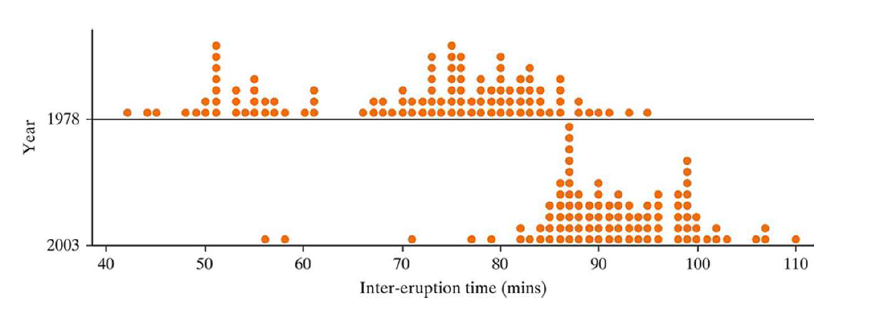
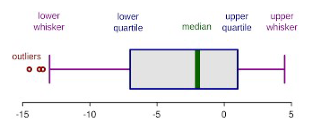
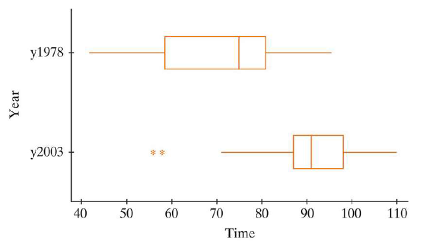

## Section 6.1 Learning Objectives {.center}

-   Calculate or estimate the mean, median, quartiles, five number summary, and interquartile range from a dataset and understand what these are measuring.

-   When comparing two quantitative distributions, identify which has the larger mean, median, standard deviation, and inter-quartile range.

-   Identify whether there is likely an association between a binary categorical variable and a quantitative response variable.

## Recap {.center}

-   When comparing two groups, we've had...

    -   A categorical explanatory variable
    -   A categorical response variable

-   Research question: Are these two explanatory groups different?

-   What changes when our response is numerical?

## Recap {.center}

Standard Error for Two Proportions:

$$SE_p=\sqrt{\hat{p}(1-\hat{p})(\frac{1}{n_1}+\frac{1}{n_2})}$$

$$OR$$

$$SE=\sqrt{\frac{\hat{p}_1(1-\hat{p}_1)}{n_1}+\frac{\hat{p}_2(1-\hat{p}_2)}{n_2}}$$

## Standarized Statistic for Two Proportions {.center}

$$z=\frac{(\hat{p}_{1} - \hat{p}_{2})-0}{\sqrt{\hat{p}(1-\hat{p})(\frac{1}{n_1}+\frac{1}{n_2})}}$$

Here, we use the pooled standard error since we assume $\hat{p}_1=\hat{p}_2$.

## Confidence Interval for Two Proportions {.center}

$$CI=(\hat{p}_1-\hat{p}_2)±2*\sqrt{\frac{\hat{p}_1(1-\hat{p}_1)}{n_1}+\frac{\hat{p}_2(1-\hat{p}_2)}{n_2}}$$

Here, our SE is NOT pooled, since we assume $\hat{p}_1≠\hat{p}_2$

# Summarizing Numerical Data

## Overview {.center}

How did we summarize categorical data?

-   Segmented bar graphs

-   Two-way tables

-   Difference in proportions

-   Relative risk

. . .

We'll need different methods for numerical data.

## Overview {.center}

To summarize numerical data, we use:

-   Dot plots

-   Five number summaries

-   Boxplots

-   Difference in averages

# Geyser Example

## Old Faithful Geyser {.center}

-   Want to look at difference in eruption patterns between 1978 and 2003

    -   Specifically, if average time between eruptions has changed

-   107 eruptions in 1978 were examined

-   95 eruptions in 2003 were examined

## Old Faithful Geyeser {.center}

-   What is the explanatory variable? [**Year observed**]{.fragment}

    -   Is it categorical or numerical? [**Categorical**]{.fragment}

-   What is the response variable? [**Average time between eruptions**]{.fragment}

    -   Is it categorical or numerical? [**Numerical**]{.fragment}

## Geyser Data Distribution {.center}

Let's compare the distributions of the two years:

{fig-alt="Two dotplots (one on top of the other) displaying data for time between geyser eruptions. The top dotplot is data from 1978 and the bottom dotplot is data from 2003. The 1978 data has two mounds and the average eruption time appears around 70. The 2003 data has one distinct mound with an average that appears around 90." fig-align="center"}

. . .

How can we describe the data using shape, spread, center, and outliers?

# Five Number Summary

## Five Number Summary {.center}

The five number summary consists of:

-   Minimum value
-   Maximum value
-   Lower quartile (Q1)
-   Median
-   Upper quartile (Q2)

## Median, Lower Quartile & Upper Quartile {.center}

Recall, the **median** is calculated by ordering the data and determining the midpoint (50%).

-   The process is the same for the lower quartile (Q1) and upper quartile (Q3)

-   **Q1**: Value for which 25% of the data falls below

-   **Q3**: Value for which 75% of the data falls below

## Displaying the Five Number Summary {.center}

A **boxplot** can display all five number summary values.

{fig-alt="Example boxplot with the outliers, lower whisker, lower quartile, median, upper quartile, and upper whisker labeled." fig-align="center"}

Q3 minus Q1 gives the **interquartile range**.

## Geyser Data {.center}

The five number summary for both years:

```{r message=FALSE, fig.align="center"}
library(dplyr)
library(gt)
library(janitor)
geyser <- data.frame(
  Year = c("1978","2003"),
  Minimum = c("42","56"),
  Q1 = c("58","87"),
  Median = c("75","91"),
  Q3 = c("81","98"),
  Maximum = c("95","110"),
  Average = c("71.1","91.2")
)

geyser %>% gt() %>%
  opt_stylize(style=6) %>%
  cols_align(align = "center",
             columns = everything()) %>%
  cols_width(everything() ~ px(275)) %>%
  tab_style(style = cell_borders(sides = "all"),
            locations = cells_body(everything())) %>%
  opt_table_font(size = px(34)) %>%
  tab_options(table.width = pct(100))

```

## Geyser Example Boxplots {.center}

{fig-alt="Two stacked boxplots displaying the geyser data for each year. The boxplot for 1978 has a lower median than the boxplot for 2003. The 2003 boxplot also has two outliers." fig-align="center"}


