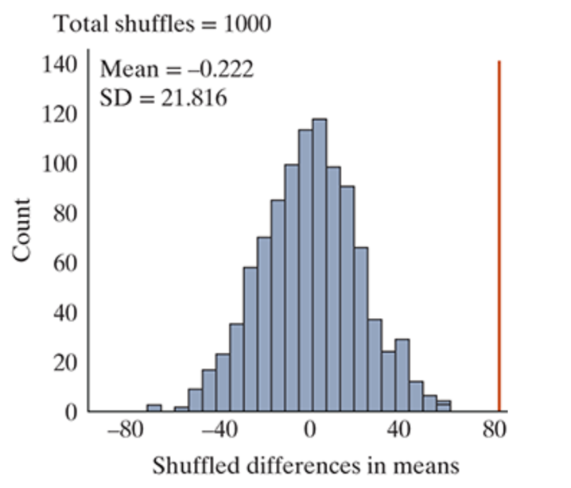
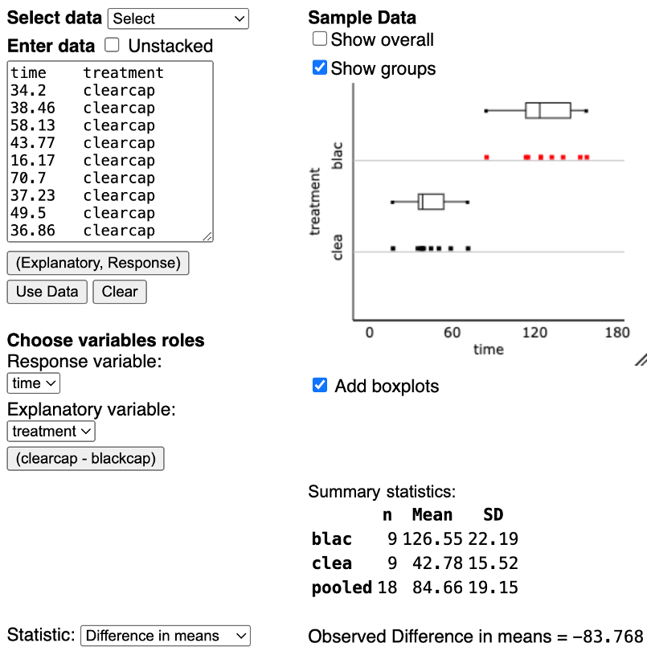
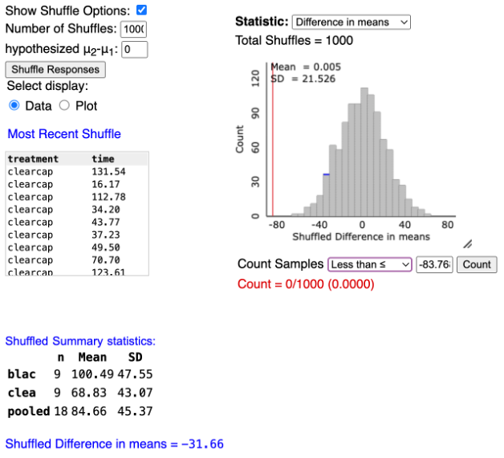

## Section 6.2 Learning Objectives {.center style="font-size: 35px"}

-   Give the null and alternative hypothesis that compares two categories for a categorical explanatory variable and the means of a numerical response variable.

-   Find and interpret the standardized statistic and the p-value for a test of two means.

-   Use the 2SD method to find a 95% confidence interval for the difference in population means for two “treatment” groups, and interpret the interval in the context of the study, specifically when it contains zero.

-   State a complete conclusion in the context of a scenario about the null and alternative hypotheses based on the p-value/standardized statistic.

## 3S Strategy: Statistic {.center}

With numerical variables, now we're focused on *averages*.

-   [**Parameter:**]{.underline} The difference in long run averages between two groups

    -   $\mu_{Group\:1} - \mu_{Group\:2}$

. . .

-   [**Observed Statistic:**]{.underline} The difference in conditional averages

    -   $\bar{x}_{Group\:1} - \bar{x}_{Group\:2}$

## 3S Strategy: Simulate & Strength of Evidence {.center}

Next, we simulate to gather strength of evidence in favor of $H_A$

-   Null Hypothesis: There is no difference between the long run averages of two groups

-   Alt. Hypothesis: There is a difference between the long run averages of two groups

## 3S Strategy: Simulate & Strength of Evidence {.center}

In symbols:

-   $H_0: \mu_{Group\:1} - \mu_{Group\:2} = 0$

-   $H_A: \mu_{Group\:1} - \mu_{Group\:2} >,<,\neq 0$

## 3S Strategy: Simulate & Strength of Evidence {.center}

Recall, we can alternatively write our hypotheses as:

-   $H_0: \mu_{Group\:1} = \mu_{Group\:2}$

-   $H_A: \mu_{Group\:1} >,<,\neq \mu_{Group\:2}$

## Recall: Symbol Comparison for ONE Proportion/Mean {.center}

|  |  |  |
|-------------------------|:----------------------:|:---------------------:|
|  | **Categorical Variable** | **Numerical Variable** |
| **Parameter of Interest** | $$                       
                             \pi                       
                             $$ | $$                     
                                                        \mu                     
                                                        $$ |
| **Observed Statistic** | $$                       
                             \hat{p}                   
                             $$ | $$                     
                                                        \bar{x}                 
                                                        $$ |

## Symbol Comparison for TWO Proportions/Means {.center}

|  |  |  |
|-------------------------|:----------------------:|:---------------------:|
|  | **Categorical Response Variable** | **Numerical Response Variable** |
| **Parameter of Interest** | $$                       
                             \pi_1-\pi_2                       
                             $$ | $$                     
                                                        \mu_1-\mu_2                     
                                                        $$ |
| **Observed Statistic** | $$                       
                             \hat{p}_1-\hat{p}_2                   
                             $$ | $$                     
                                                        \bar{x}_1-\bar{x} _2                
                                                        $$ |

. . .

Notice the pattern here!

# Dung Beetle Example

## Dung Beetles {.center}

-   Researchers want to investigate if a certain type of dung beetle can navigate using the stars

-   18 total beetles

-   Process:

    ::: incremental
    -   Place all 18 beetles on a platform on a moonless night
    -   9 receive a black cap to obstruct their sight; the other 9 receive a clear cap as a placebo
    -   The time taken for each beetle to reach the edge of the platform is recorded
    :::

## Dung Beetles {.center}

-   Explanatory variable: [**Black cap or clear cap**]{.fragment}

    -   Categorical or numerical? [**Categorical**]{.fragment}

-   Response variable: [**Time taken to reach the edge**]{.fragment}

    -   Categorical or numerical? [**Numerical**]{.fragment}

## Dung Beetles {.center}

$\mu$ = long run average time it takes to reach the edge of the platform

-   $\mu_b$ = Long run average time for beetles with the black cap

-   $\mu_c$ = Long run average time for beetles with the clear cap

## Dung Beetles {.center}

If dung beetles can navigate using the stars, we would expect $\mu_b$ to be larger (longer time).

-   Parameter: $\mu_b - \mu_c$

-   "The difference in long run average time to get to the edge of the platform between the beetles with the black cap and beetles with the clear cap."

## Dung Beetles {.center}

Hypotheses:

-   Null: There is no difference in average time taken to get to the edge between the two groups

-   Alt: The average time for the group with the black cap is longer

In symbols:

-   $H_0: \mu_b - \mu_c = 0$

-   $H_0: \mu_b - \mu_c > 0$

# Strength of Evidence

## P-values {.center}

-   P-value: how likely we are to observe a difference in sample means as or more extreme than the one we saw in the data, based on the null distribution.

-   P-value \< significance level, reject the null

    -   Strong evidence that the two groups are different

-   P-value ≥ significance level, fail to reject the null

    -   No evidence that the groups are different from each other

## Null Distribution {.center}

{fig-alt="Simulated null distributions for the difference between two means. The distribution is normal-looking and centered at zero." fig-align="center"}

## Null Distribution {.center}

The null distribution is simulated assuming: $H_0: \mu_b - \mu_c = 0$

-   As with proportions, the middle of the null distribution is zero

## Multiple Means Applet {.center}

{fig-alt="Screenshot of multiple means applet. On the left panel, the time and treatment (black or clear cap) is given for the data set. Boxplots displaying the data for each group are shown on the right. Summary statistics are given below the boxplot panel." fig-align="center" width="600"}

## Observed Statistic {.center}

Similar to proportions, the observed statistic is just the observed difference in means between the two groups.

-   $\bar{x}_b - \bar{x}_c=126.55-42.78=83.768$

## Finding the P-value {.center}

{fig-alt="Screenshot of the multiple means applet. The simulated data outcome and summary statistics are shown on the left. On the right, there is a null distribution with a red line drawn where the observed statistic lies. The p-value is 0/1000." fig-align="center"}

## Finding the P-value {.center}

We find the p-value the same way as before.

-   Given our observed statistic, how many *simulated* values are as or more extreme?

-   On the previous slide, p-value = 0/1000

    -   This is less than 0.05, reject $H_A$

## Standardized Statistic (SS) {.center}

General form:

$$t=\frac{Observed\: Statistic - Hypothesized\: Value}{Standard\: Deviation\: under\: the\: null}$$

$$=\frac{(\bar{x}_1-\bar{x}_2)-0}{SD\: from\: Applet}$$

## Standardized Statistic (SS) {.center}

Same conclusions as before

-   Outside the 2s, reject the null (strong evidence)

-   Inside the 2s, fail to reject the null (weak evidence)

## Conclusion {.center}

"We (**do/do not**) have strong evidence to conclude that the long run difference in averages of (**context**) between group 1 and group 2 is (**less than/greater than/not equal to**) zero."

## Dung Beetle Standardized Statistic {.center}

$$t=\frac{\bar{x}_b-\bar{x}_c}{SD\: from\: Applet}=\frac{83.768}{21.526}=3.89$$

. . .

This is outside the twos, so we reject $H_A$

## Confidence Intervals (CI) {.center}

2SD Confidence Interval:

$$CI=(Lower\: Bound,\: Upper\: Bound)$$

$$=Observed\: Statistic\: ± Margin\: of\: Error$$

$$CI = (\bar{x}_1-\bar{x}_2) ± 2*(SD\: from\: Applet)$$

## 2SD CI Interpretation {.center}

"We are 95% confident that the long run difference in averages of (**context**) between group 1 and group 2 is between (**lower bound**) and (**upper bound**)."

## Conclusions based on CI {.center}

Our hypothesized parameter value is *always* zero, therefore...

-   If 0 is IN the interval, fail to reject $H_0$

    -   It's possible the groups are the same

## Conclusions based on CI {.center}

Our hypothesized parameter value is *always* zero, therefore...

-   If 0 is OUTSIDE the interval, reject $H_0$

    -   The groups are different

## Dung Beetle CI {.center}

$$CI = (\bar{x}_b-\bar{x}_c) ± 2*(SD\: from\: Applet)$$

$$= 83.768 ± 2*21.526$$

$$= (40.72,126.82)$$

## Interpretation {.center}

"We are 95% confident that the long run average time for the black cap group is 40.72 to 126.82 seconds longer than the long run average time for the clear cap group."

## Conclusions {.center}

-   Because zero is not in the interval, we reject $H_A$

-   Notice, the conclusions we draw from our p-value, standardized statistic, and confidence interval all match!

. . .

We have strong evidence to conclude that the dung beetles do navigate by the stars.
