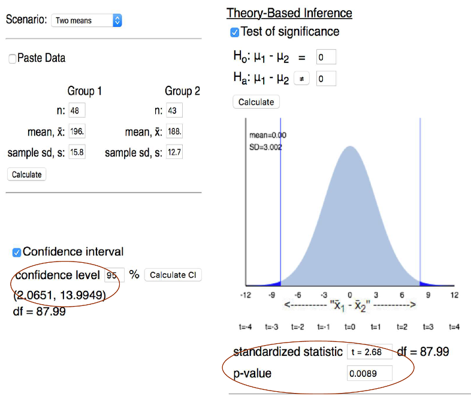

## Section 6.3 Learning Objectives {.center}

-   Identify when a theory-based approach would be valid to find the p-value, standardized statistic, or a confidence interval when evaluating the relationship between one binary and one quantitative variable.

# Recap

## Comparing Two Groups {.center}

What are we interested in?

-   [**Parameter:**]{.underline} The difference in long run proportions between two groups

    -   $\mu_{Group\:1} - \mu_{Group\:2}$

We estimate the parameter using:

-   [**Observed Statistic:**]{.underline} The difference in conditional proportions

    -   $\bar{x}_{Group\:1} - \bar{x}_{Group\:2}$

## Hypotheses for Two Groups {.center}

-   Null Hypothesis: There is no difference between the long run averages of two groups

-   Alt. Hypothesis: There is a difference between the long run averages of two groups

    -   Difference can be greater than, less than, or not equal to

## Hypotheses for Two Groups {.center}

In symbols:

-   $H_0: \mu_{Group\:1} - \mu_{Group\:2} = 0$

-   $H_A: \mu_{Group\:1} - \mu_{Group\:2} >,<,\neq 0$

. . .

Equivalently, we could also write:

-   $H_0: \mu_{Group\:1}=\mu_{Group\:2}$

-   $H_A: \mu_{Group\:1}>,<,\neq\mu_{Group\:2}$

# Strength of Evidence

## Determining Strength of Evidence {.center}

Similar to previous chapters, we first find strength of evidence using *simulation*.

-   Now, we want to use the theory-based approach to find:

    -   P-value

    -   Standardized statistic

    -   Confidence interval

## Strength of Evidence Using Simulation {.center}

For two groups, the Applet does the following to simulate:

-   Study data is input

-   All responses (some numerical value) from the study are put on "cards"

-   For one study simulation, cards are randomly split into the two explanatory groups

-   Sample averages (\$\bar{x}) are calculated for each group

## Validity Conditions for Theory-Based Approach {.center}

To use the theory-based approach for two groups (with a numerical response variable):

-   Each group needs at least 20 observations

-   Distributions must not be strongly skewed

    -   Can look at distributions via a boxplot, dotplot, etc.

## Standard Error Formula for Two Means {.center}

$$SE=\sqrt{\frac{s_{1}^{2}}{n_1}+\frac{s_{2}^{2}}{n_2}}$$

We use the same formula for both confidence intervals and standardized statistics! (No "pooled" SE.)

## Two Sample T-Test {.center}

General standardized statistic (SS) formula:

$$SS=\frac{Observed\: Statistic - Hypothesized\: Value}{Standard\: Error\: under\: the\: null}$$

When comparing two groups:

$$t=\frac{(\bar{x}_{1} - \bar{x}_{2})-0}{\sqrt{\frac{s_{1}^{2}}{n_1}+\frac{s_{2}^{2}}{n_2}}}$$

## Standardized Statistic Interpretation {.center}

-   Interpretation remains essentially the same

-   "$\bar{x}_1$ is \_\_\_ standard deviations away from $\bar{x}_2$"

## Confidence Interval for Two Groups {.center}

General confidence interval formula:

$$CI=Observed\: Statistic\: ± Multiplier*SE$$

When comparing two groups:

$$CI=(\bar{x}_{1} - \bar{x}_{2})±2*\sqrt{\frac{s_{1}^{2}}{n_1}+\frac{s_{2}^{2}}{n_2}}$$

## Confidence Interval Interpretation {.center}

-   "We are 95% confident that the long run difference in averages of **context** between **group 1** and **group 2** falls between **lower bound** and **upper bound**."

. . .

Alternatively, we can say:

-   "We're 95% confident that the true average of **context** in **group 1** is **lower bound** to **upper bound** **more/less** than the true average of **context** in **group 2**."

# Example

## NFL Referees {.center}

-   In 2012, the first three weeks of NFL play were refereed by replacement referees

-   Want to examine data to determine if games were longer or shorter when refereed by the replacements

-   Three weeks of games were observed for each set of referees (replacement and regular)

## Referee Data {.center}

```{r message=FALSE, fig.align="center"}
library(dplyr)
library(gt)
library(janitor)
ref <- data.frame(
  Group = c("Regular Refs","Replacement Refs","Pooled"),
  n = c("43","48","91"),
  Mean = c("188.47","196.50","192.70"),
  SD = c("12.73","15.86","14.47")
)

ref %>% gt() %>%
  opt_stylize(style=6) %>%
  cols_align(align = "center",
             columns = everything()) %>%
  cols_width(everything() ~ px(275)) %>%
  tab_style(style = cell_borders(sides = "all"),
            locations = cells_body(everything())) %>%
  opt_table_font(size = px(34)) %>%
  tab_options(table.width = pct(100))
```

The distributions are not strongly skewed.

. . .

Can we use the theory-based approach here?

## NFL Referees {.center}

-   Explanatory variable: [**Regular refs or replacement refs**]{.fragment}

-   Response variable: [**Length of game that was reffed**]{.fragment}

-   Parameter of interest: [**Difference in long run average game time between games reffed by replacement refs versus regular refs. (**$\mu_{rep}-\mu_{reg}$**)**]{.fragment}

## Setting up the hypotheses {.center}

-   $H_0: \mu_{rep}-\mu_{reg}=0$

-   $H_A: \mu_{rep}-\mu_{reg} \neq 0$

Here, we are just looking for a difference, so we use $\neq$.

-   Equivalent to: $H_A: \mu_{rep}\neq\mu_{reg}$

## Calculating the Standardized Statistic {.center}

::::: columns
::: {.column width="60%"}
<br>

```{r message=FALSE, fig.align="center"}
library(dplyr)
library(gt)
library(janitor)
ref <- data.frame(
  Group = c("Regular Refs","Replacement Refs","Pooled"),
  n = c("43","48","91"),
  Mean = c("188.47","196.50","192.70"),
  SD = c("12.73","15.86","14.47")
)

ref %>% gt() %>%
  opt_stylize(style=6) %>%
  cols_align(align = "center",
             columns = everything()) %>%
  tab_style(style = cell_borders(sides = "all"),
            locations = cells_body(everything())) %>%
  opt_table_font(size = px(32)) %>%
  tab_options(table.width = pct(80))
```
:::

::: {.column width="40%"}
-   $n_{reg}=43$
-   $n_{rep}=48$
-   $\bar{x}_{reg}=188.47$
-   $\bar{x}_{rep}=196.50$
-   $s_{reg}=12.73$
-   $s_{rep}=15.86$
:::
:::::

## Calculating the Standardized Statistic {.center}

$$t=\frac{(\bar{x}_{rep} - \bar{x}_{reg})-0}{\sqrt{\frac{s_{rep}^{2}}{n_{rep}}+\frac{s_{reg}^{2}}{n_{reg}}}}$$

$$=\frac{196.50-188.47}{\sqrt{\frac{15.86^{2}}{48}+\frac{12.73^{2}}{43}}}$$

$$=2.63$$

## Calculating the Confidence Interval {.center}

$$CI=(\bar{x}_{rep} - \bar{x}_{reg})±2*\sqrt{\frac{s_{rep}^{2}}{n_{rep}}+\frac{s_{reg}^{2}}{n_{reg}}}$$

$$CI=(196.50-188.47)±2*\sqrt{\frac{15.86^{2}}{48}+\frac{12.73^{2}}{43}}$$

$$=8.03±2*2.98=(2.07,13.99)$$

## Interpreting the Confidence Interval {.center}

"We are 95% confident that games reffed by the replacement referees differ by 2.07 to 13.99 minutes from games reffed by the regular referees."

## Theory-Based Inference Applet {.center}

{fig-alt="Screenshot of the theory based inference applet. On the left side, data for each group is entered (sample size, sample mean, and sample standard deviation). At the bottom left, the confidence interval is calculated. On the right, the normal distribution is shown and gives the standardized statistic and p-value." fig-align="center"}

[Theory-Based Inference Applet](https://www.isi-stats.com/isi2nd/ISIapplets2020.html)

## Drawing Conclusions {.center}

Standardized statistic and confidence interval:

-   $z=2.63$

    -   Outside the twos

-   $CI=(2.07,13.99)$

    -   Zero is not in the confidence interval

-   P-value = 0.0089 \< 0.05

-   Note that all three methods point to the same conclusion: reject $H_0$

## Drawing Conclusions {.center}

"We have strong evidence to conclude that NFL games reffed by replacement referees last longer than games that are reffed by the regular referees."
