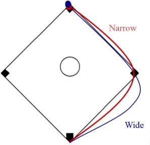
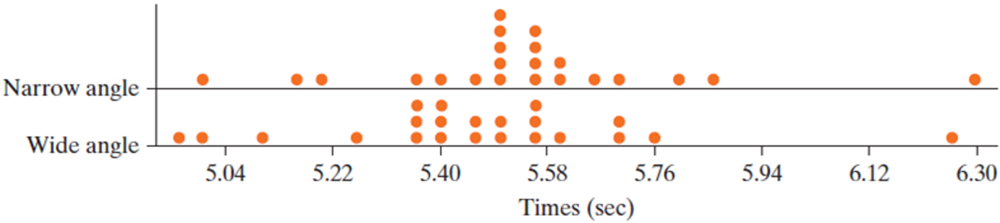
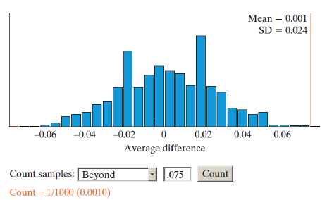

## Section 7.2 Learning Objectives {.center}

-   Understand the difference between independent samples and paired samples in terms of the study design and how variability can be lower in a paired design and how this can influence the strength of evidence.

-   Complete a simulation-based test of significance of a paired design by writing out the hypothesis, determining the observed statistic, computing the p-value, and writing out an appropriate conclusion.

# Example: Rounding First Base

## Rounding First Base {.center}

{fig-alt="Picture of a baseball diamond with two paths to round first base drawn. A red path takes a narrow trajectory to round the base; a blue path takes a wide trajectory to round the base." fig-align="center"}

## The Setup {.center}

-   22 baseball players

-   Players were to round first base

    -   Timed from 35 feet past home to 15 feet before second base

-   Two strategies implemented:

    -   Wide path
    -   Narrow path

## The Setup {.center}

-   Each player ran both paths

-   Each player had adequate rest in between runs

-   Random assignment determined which path a runner ran first

. . .

What type of design is this? (Independent, matched pairs, or repeated measures?)

## Determining Variables {.center}

-   Explanatory variable? Categorical or numerical?

-   Response variable? Categorical or numerical?

-   Observational study or experiment?

## Study Data {.center}

```{r message=FALSE, fig.align="center"}
library(dplyr)
library(gt)
library(janitor)
baseball <- data.frame(
  Subject = c("Narrow","Wide"),
  `1` = c("5.50","5.55"), `2` = c("5.70","5.75"), `3` = c("5.60","5.50"),
  `4` = c("5.50","5.40"), `5` = c("5.85","5.70"), `6` = c("5.55","5.60"),
  `7` = c("5.40","5.35"), `8` = c("5.50","5.35"), `9` = c("5.15","5.00"),
  `10` = c("5.80","5.70"), `X` = c("...","..."), check.names = FALSE
)

baseball %>% gt() %>%
  opt_stylize(style=6) %>%
  cols_align(align = "center",
             columns = everything()) %>%
  tab_style(style = cell_borders(sides = "all"),
            locations = cells_body(everything())) %>%
  opt_table_font(size = px(34)) %>%
  tab_options(table.width = pct(100))

```

## Data Plot {.center}

{fig-alt="Stacked dot plots for the wide angle and narrow angle. The plots are nearly identical; both have one mound with one outlier on the far right." fig-align="center"}

## Paired Design Setup {.center}

**Parameter:** The long run average difference of \_\_\_\_ between group 1 and group 2.

-   Symbol: $\mu_d$

-   This is different from $\mu_1-\mu_2$

**Observed statistic:** $\bar{x}_d$

## Paired Design Hypotheses {.center}

In words:

-   Null: The long run average difference of \_\_\_ between group 1 and group 2 is zero.

-   Alt: The long run average difference of \_\_\_ between group 1 and group 2 is (not equal to, greater than, less than) zero.

. . .

Symbols:

-   $H_0: \mu_d = 0$

-   $H_A: \mu_d >,<,\neq 0$

## Mean Difference {.center}

-   Paired design

-   Take the difference between the two groups for each observation, then take the mean of the differences

-   Parameter: $\mu_d$

## Difference in Means {.center}

-   Independent design

-   Take the group means, then take the difference between them

-   Parameter $\mu_1-\mu_2$

## Mean Difference vs. Difference in Means {.center}

```{r message=FALSE, fig.align="center"}
library(dplyr)
library(gt)
library(janitor)
data <- data.frame(
  Group1 = c(4,7,1),
  Group2 = c(2,4,3)
)

names(data) <- c("Group 1","Group 2")

data %>% gt() %>%
  opt_stylize(style=6) %>%
  cols_align(align = "center",
             columns = everything()) %>%
  cols_width(everything() ~ px(275)) %>%
  tab_style(style = cell_borders(sides = "all"),
            locations = cells_body(everything())) %>%
  opt_table_font(size = px(34)) %>%
  tab_options(table.width = pct(100))

```

## Rounding First Base {.center}

-   Parameter: Long run average difference in running times for runners using the narrow path vs. the wide path ($\mu_d$)

Hypotheses:

-   $H_0: \mu_d = 0$

-   $H_A: \neq 0$

## Study Data {.center}

```{r message=FALSE, fig.align="center"}
library(dplyr)
library(gt)
library(janitor)
baseball2 <- data.frame(
  Subject = c("Narrow","Wide","Difference"),
  `1` = c("5.50","5.55","-0.05"), `2` = c("5.70","5.75","-0.05"), `3` = c("5.60","5.50","0.10"),
  `4` = c("5.50","5.40","0.10"), `5` = c("5.85","5.70","0.15"), `6` = c("5.55","5.60","-0.05"),
  `7` = c("5.40","5.35","0.05"), `8` = c("5.50","5.35","0.15"), `9` = c("5.15","5.00","0.15"),
  `10` = c("5.80","5.70","0.10"), `X` = c("...","...","..."), check.names = FALSE
)

baseball2 %>% gt() %>%
  opt_stylize(style=6) %>%
  cols_align(align = "center",
             columns = everything()) %>%
  tab_style(style = cell_borders(sides = "all"),
            locations = cells_body(everything())) %>%
  opt_table_font(size = px(34)) %>%
  tab_options(table.width = pct(100))

```

## Finding Strength of Evidence {.center}

Observed statistic: $\bar{x}_d=0.075$

-   This isn't zero, but is it enough evidence to conclude the two strategies are truly different?

We can use simulation to obtain:

-   P-value

-   Standardized statistic

-   Confidence interval

## Simulation {.center}

-   Simulate using a coin flip

-   Heads = flip the sign (positive or negative)

-   Tails = sign remains the same

-   Do this for all n=22 differences (observations)

-   Calculate and record a new $\bar{x}_d$

-   Repeat many times

## Simulation Example {.center}

```{r message=FALSE, fig.align="center"}
library(dplyr)
library(gt)
library(janitor)
sim <- data.frame(
  Subject = c("Narrow","Wide","Difference","Coin Flip","Sim. Diff."),
  `1` = c("5.50","5.55","-0.05","H","0.05"), 
  `2` = c("5.70","5.75","-0.05","T","-0.05"), 
  `3` = c("5.60","5.50","0.10","H","-0.10"),
  `4` = c("5.50","5.40","0.10","T","0.10"), 
  `5` = c("5.85","5.70","0.15","T","0.15"), 
  `6` = c("5.55","5.60","-0.05","T","-0.05"),
  `7` = c("5.40","5.35","0.05","T","0.05"), 
  `8` = c("5.50","5.35","0.15","H","-0.15"), 
  `9` = c("5.15","5.00","0.15","H","-0.15"),
  `10` = c("5.80","5.70","0.10","H","-0.10"), 
  `X` = c("...","...","...","...","..."), check.names = FALSE
)

sim %>% gt() %>%
  opt_stylize(style=6) %>%
  cols_align(align = "center",
             columns = everything()) %>%
  tab_style(style = cell_borders(sides = "all"),
            locations = cells_body(everything())) %>%
  opt_table_font(size = px(30)) %>%
  tab_options(table.width = pct(100))

```

Simulated average: $\bar{x}_d=0.011$

## Simulating the Null Distribution {.center}

{fig-alt="Simulated null distribution of average difference between group 1 and group 2. Mean is 0.001 and SD is 0.024. Distribution is mound shaped. P-value is 1/1000 = 0.001." fig-align="center"}

Based on this null distribution, only 1/1000 simulated values were as or more extreme than 0.075.

-   P-value = 0.001 \< 0.05

## Standardized Statistic {.center}

::::: columns
::: {.column width="30%"}
$$z=\frac{\bar{x}_d}{SD}$$

$$=\frac{0.075}{0.024}$$

$$=3.125$$

Outside 2s, reject $H_0$

:::

::: {.column width="70%"}
<br><br>

{fig-alt="Simulated null distribution of average difference between group 1 and group 2. Mean is 0.001 and SD is 0.024. Distribution is mound shaped. P-value is 1/1000 = 0.001." fig-align="center"}
:::
:::::

## 95% Confidence Interval {.center}

::::: columns
::: {.column width="30%"}
$$CI=\bar{x}_d±2*SD$$

$$=0.075±2*0.024$$

$$=(0.027,0.124)$$

Zero is not in the interval, reject $H_0$

:::

::: {.column width="70%"}
<br><br>

{fig-alt="Simulated null distribution of average difference between group 1 and group 2. Mean is 0.001 and SD is 0.024. Distribution is mound shaped. P-value is 1/1000 = 0.001." fig-align="center"}
:::
:::::