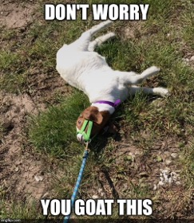
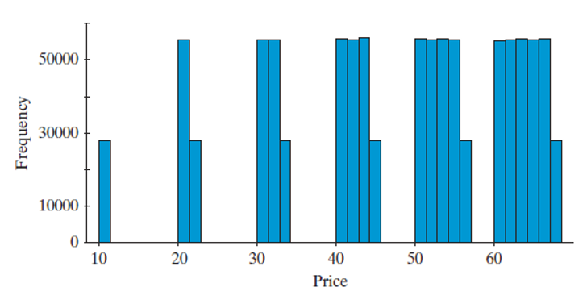

## Section 11.1 Learning Objectives {.center}

-   Describe how to conduct simulation analyses of random processes.

-   List outcomes in the sample space of a random process.

-   Determine whether outcomes of a random process are equally likely.

-   Calculate probabilities for random processes with equally likely outcomes.

-   Interpret a calculated probability and explain how it depends on assumptions made.

# Introduction to Probability

## Simulating Probability

-   Back in P.3, we simulated probability

-   Simulation *models a random process*

    -   Gives us an *estimate* for probability
    
-   **Goals:** 

    ::: incremental
    -   See how probability changes when a random process is modified
    
    -   Learn how to get *exact* probabilities using a mathematical approach
    :::
    
## Recall: Cars vs. Goats {.center style="font-size: 35px"}

::::: columns
::: {.column width="60%"}
-   Inspired by the classic Monty Hall problem from Let's Make a Deal!
-   Three doors: two goats, one car
-   After one door is revealed, should you...
    -   Stay with your choice
    -   Choose the other door
-   Goal: Use simulation to determine a long-run trend
    -   AKA: Long run *probability*
:::

::: {.column width="40%"}
{width="110%" height="110%" fig-alt="Goat lying down with caption 'Don't worry you goat this.'"}
:::
:::::

# Example: Ice Cream Prices

## The Scenario {.center}

An ice cream shop offers the following promotion:

-   The price of an ice cream cone is decided by rolling two six-sided dice

-   The price, in cents, is the larger number followed by the smaller one

. . .

If you walked into the store with $.50, what is the probability you could pay for your cone?

## The Scenario {.center}

-   What is the *most* you could pay?

-   What is the *least* you could pay?

. . .

Do you think the probability you could afford the ice cream is more or less than 0.50?

## Simulating Probability {.center style="font-size: 35px"}

::::: columns
::: {.column width="60%"}
1,000,000 rolls were simulated under the ice cream shop scenario
<br>
Based on the histogram:

-   What is the mean?

-   What is the standard deviation?

-   What are the short bars?
:::

::: {.column width="40%"}
{fig-alt="Histogram of 1000 simulations of dice rolls and their resulting ice cream prices."}
:::
:::::

## Simulating Probability {.center style="font-size: 35px"}

::::: columns
::: {.column width="60%"}
To answer the bigger question, how many simulated rolls were $.50 or less?

-   444,991/1,000,000 = 0.445

How could we find this without simulation?
:::

::: {.column width="40%"}
{fig-alt="Histogram of 1000 simulations of dice rolls and their resulting ice cream prices."}
:::
:::::

## Sample Space {.center}

A list of all possible outcomes for a random process.

-   Probabilities of all outcomes in a sample space must add up to 1 (100%)

## Ice Cream Example Sample Space {.center}

Sample space: all combinations of rolling two dice

```{r message=FALSE, fig.align="center"}
library(dplyr)
library(gt)
library(janitor)
dice <- data.frame(
  `1` = c("(1,1)","(2,1)","(3,1)","(4,1)","(5,1)","(6,1)"),
  `2` = c("(1,2)","(2,2)","(3,2)","(4,2)","(5,2)","(6,2)"),
  `3` = c("(1,3)","(2,3)","(3,3)","(4,3)","(5,3)","(6,3)"),
  `4` = c("(1,4)","(2,4)","(3,4)","(4,4)","(5,4)","(6,4)"),
  `5` = c("(1,5)","(2,5)","(3,5)","(4,5)","(5,5)","(6,5)"),
  `6` = c("(1,6)","(2,6)","(3,6)","(4,6)","(5,6)","(6,6)")
)

dice %>% gt() %>%
  # opt_stylize(style=6) %>%
  # rm_header() %>%
  cols_align(align = "center",
             columns = everything()) %>%
  cols_width(everything() ~ px(275)) %>%
  tab_style(style = cell_borders(sides = "all"),
            locations = cells_body(everything())) %>%
  opt_table_font(size = px(34)) %>%
  tab_options(table.width = pct(100)) %>%
  tab_options(column_labels.hidden = TRUE)

```

## Sample Space Activity {.center}

For both of the following, write down what you think the sample space is.

1.  Tossing two coins

2.  Spinning two spinners that each have letters A, B, and C as outcomes

## Event {.center}

A collection or (or subset) of outcomes from a sample space.

-   This subset of events may also be referred to as **event space**

## Ice Cream Example Event Space {.center}

How many outcomes in the sample space fit our criteria for being $.50 or less?

```{r message=FALSE, fig.align="center"}
library(dplyr)
library(gt)
library(janitor)
event <- data.frame(
  `1` = c("(1,1)=$.11","(2,1)=$.21","(3,1)=$.31",
          "(4,1)=$.41","(5,1)=$.51","(6,1)=$.61"),
  `2` = c("(1,2)=$.21","(2,2)=$.22","(3,2)=$.32",
          "(4,2)=$.42","(5,2)=$.52","(6,2)=$.62"),
  `3` = c("(1,3)=$.31","(2,3)=$.32","(3,3)=$.33",
          "(4,3)=$.43","(5,3)=$.53","(6,3)=$.63"),
  `4` = c("(1,4)=$.41","(2,4)=$.42","(3,4)=$.43",
          "(4,4)=$.44","(5,4)=$.54","(6,4)=$.64"),
  `5` = c("(1,5)=$.51","(2,5)=$.52","(3,5)=$.53",
          "(4,5)=$.54","(5,5)=$.55","(6,5)=$.65"),
  `6` = c("(1,6)=$.61","(2,6)=$.62","(3,6)=$.63",
          "(4,6)=$.64","(5,6)=$.65","(6,6)=$.66")
)

event %>% gt() %>%
  # opt_stylize(style=6) %>%
  # rm_header() %>%
  cols_align(align = "center",
             columns = everything()) %>%
  cols_width(everything() ~ px(275)) %>%
  tab_style(style = cell_borders(sides = "all"),
            locations = cells_body(everything())) %>%
  opt_table_font(size = px(30)) %>%
  tab_options(table.width = pct(100)) %>%
  tab_options(column_labels.hidden = TRUE)

```

## Event Space Activity {.center}

Now for the given event, what is the event space?

1.  Tossing two coins

    -   Event: Getting at least one tail

2.  Spinning two spinners that each have letters A, B, and C as outcomes

    -   Event: At least one spinner lands on C

## Ice Cream Example Event Space {.center}

-   36 total outcomes

-   Probability of affording ice cream: 16/36 = 0.444

```{r message=FALSE, fig.align="center"}
library(dplyr)
library(gt)
library(janitor)
event <- data.frame(
  `1` = c("(1,1) 11¢","(2,1) 21¢","(3,1) 31¢",
          "(4,1) 41¢","(5,1) 51¢","(6,1) 61¢"),
  `2` = c("(1,2) 21¢","(2,2) 22¢","(3,2) 32¢",
          "(4,2) 42¢","(5,2) 52¢","(6,2) 62¢"),
  `3` = c("(1,3) 31¢","(2,3) 32¢","(3,3) 33¢",
          "(4,3) 43¢","(5,3) 53¢","(6,3) 63¢"),
  `4` = c("(1,4) 41¢","(2,4) 42¢","(3,4) 43¢",
          "(4,4) 44¢","(5,4) 54¢","(6,4) 64¢"),
  `5` = c("(1,5) 51¢","(2,5) 52¢","(3,5) 53¢",
          "(4,5) 54¢","(5,5) 55¢","(6,5) 65¢"),
  `6` = c("(1,6) 61¢","(2,6) 62¢","(3,6) 63¢",
          "(4,6) 64¢","(5,6) 65¢","(6,6) 66¢")
)

event %>% gt() %>%
  # opt_stylize(style=6) %>%
  # rm_header() %>%
  cols_align(align = "center",
             columns = everything()) %>%
  cols_width(everything() ~ px(275)) %>%
  tab_style(style = cell_borders(sides = "all"),
            locations = cells_body(everything())) %>%
  opt_table_font(size = px(30)) %>%
  tab_options(table.width = pct(100)) %>%
  tab_options(column_labels.hidden = TRUE)

``` 

## New Event {.center}

Now suppose your friend will pay for the cone if the price is odd

-   What's the probability that the price would be odd?

-   Odd = 21/36 = 0.583

```{r message=FALSE, fig.align="center"}
library(dplyr)
library(gt)
library(janitor)
event <- data.frame(
  `1` = c("(1,1) 11¢","(2,1) 21¢","(3,1) 31¢",
          "(4,1) 41¢","(5,1) 51¢","(6,1) 61¢"),
  `2` = c("(1,2) 21¢","(2,2) 22¢","(3,2) 32¢",
          "(4,2) 42¢","(5,2) 52¢","(6,2) 62¢"),
  `3` = c("(1,3) 31¢","(2,3) 32¢","(3,3) 33¢",
          "(4,3) 43¢","(5,3) 53¢","(6,3) 63¢"),
  `4` = c("(1,4) 41¢","(2,4) 42¢","(3,4) 43¢",
          "(4,4) 44¢","(5,4) 54¢","(6,4) 64¢"),
  `5` = c("(1,5) 51¢","(2,5) 52¢","(3,5) 53¢",
          "(4,5) 54¢","(5,5) 55¢","(6,5) 65¢"),
  `6` = c("(1,6) 61¢","(2,6) 62¢","(3,6) 63¢",
          "(4,6) 64¢","(5,6) 65¢","(6,6) 66¢")
)

event %>% gt() %>%
  # opt_stylize(style=6) %>%
  # rm_header() %>%
  cols_align(align = "center",
             columns = everything()) %>%
  cols_width(everything() ~ px(275)) %>%
  tab_style(style = cell_borders(sides = "all"),
            locations = cells_body(everything())) %>%
  opt_table_font(size = px(30)) %>%
  tab_options(table.width = pct(100)) %>%
  tab_options(column_labels.hidden = TRUE)

``` 

## New Event {.center}

-   Now, what is the probability that the price is odd *or* less than $.50?

-   Probability = 27/36 = 0.75

```{r message=FALSE, fig.align="center"}
library(dplyr)
library(gt)
library(janitor)
event <- data.frame(
  `1` = c("(1,1) 11¢","(2,1) 21¢","(3,1) 31¢",
          "(4,1) 41¢","(5,1) 51¢","(6,1) 61¢"),
  `2` = c("(1,2) 21¢","(2,2) 22¢","(3,2) 32¢",
          "(4,2) 42¢","(5,2) 52¢","(6,2) 62¢"),
  `3` = c("(1,3) 31¢","(2,3) 32¢","(3,3) 33¢",
          "(4,3) 43¢","(5,3) 53¢","(6,3) 63¢"),
  `4` = c("(1,4) 41¢","(2,4) 42¢","(3,4) 43¢",
          "(4,4) 44¢","(5,4) 54¢","(6,4) 64¢"),
  `5` = c("(1,5) 51¢","(2,5) 52¢","(3,5) 53¢",
          "(4,5) 54¢","(5,5) 55¢","(6,5) 65¢"),
  `6` = c("(1,6) 61¢","(2,6) 62¢","(3,6) 63¢",
          "(4,6) 64¢","(5,6) 65¢","(6,6) 66¢")
)

event %>% gt() %>%
  # opt_stylize(style=6) %>%
  # rm_header() %>%
  cols_align(align = "center",
             columns = everything()) %>%
  cols_width(everything() ~ px(275)) %>%
  tab_style(style = cell_borders(sides = "all"),
            locations = cells_body(everything())) %>%
  opt_table_font(size = px(30)) %>%
  tab_options(table.width = pct(100)) %>%
  tab_options(column_labels.hidden = TRUE)

``` 

## Changing a Random Process {.center}

Main idea: probability changes as a random process (event) does
