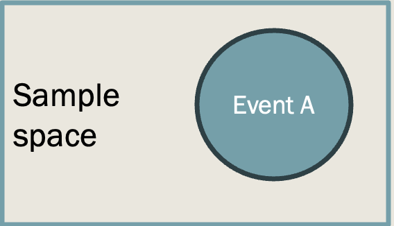
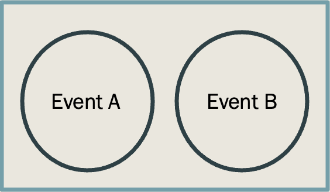
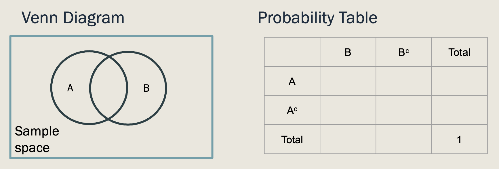
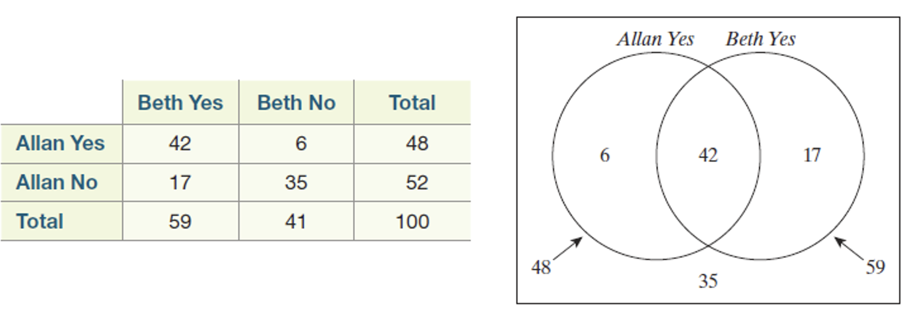

## Section 11.2 Learning Objectives {.center}

-   Express events using set notation.

-   Use the complement rule and addition rule to calculate probabilities of events.

-   Use probability tables and Venn diagrams to calculate probabilities of events.

-   Determine whether events are mutually exclusive.

# Recap

## Probability Introduction {.center}

-   Probability can be approximated through simulation

    -   Ex: Cars vs. Goats

-   A mathematical approach is more practical, convenient, and accurate

## Probability Introduction {.center}

-   **Sample space:** A collection of *all possible events* for a random process

-   **Event space:** A subset of events in the sample space that we are interested in

    -   Generally we are interested in a specific **event** (some random process)

-   As an event changes, so will probability!

    -   Ice cream example

# Probability Rules

## Probability Rules {.center}

-   Probability rules make mathematical probability calculations easier.

-   We'll look at three main rules:

    1.  Complement rule
    2.  Intersection rule
    3.  Union rule (addition rule)

. . .

First, let's cover some probability basics.

## Probability Basics {.center}

-   For some event "A", the probability that that event occurs is denoted by P(A)

-   "A" can be anything!

    -   Ex: Rolling an odd number on a die, flipping tails on a coin

-   Any capital letter can be used to represent an event

-   Probability MUST be between 0 and 1 (inclusive)

    -   $0≤P(A)≤1$

## Probability Basics {.center}

We can relate this back to sample & event space

-   Sample space contains *all possible outcomes*

-   Event space contains only the outcomes in sample space that *meet the criteria for a specific event*

-   Thus:

. . .

$$P(Event) = \frac{Number \: of \: outcomes \: in \: Event \: Space}{Number \: of \: outcomes \: in \: Sample \: Space}$$

## Sample Space vs. Event Space {.center}

{fig-alt="Figure depicting sample and event space. Sample space is denoted as a large rectangle. Event space for event A is represented as a circle within the sample space." fig-align="center" width="600"}

## Rule 1: Compliment {.center}

-   The [**compliment**]{.underline} of an event $A$, denoted by $A^c$, is the probability that event $A$ does *not* occur.

    -   "Not $A$"

-   Recall that the probability of all outcomes in sample space must sum to 1

-   Thus: $P(A^c)=1-P(A)$

## Rule 2: Intersection {.center}

-   The [**intersection**]{.underline} of events $A$ & $B$ is when both events occur *at the same time*

    -   We denote this with $\cap$

    -   $A \cap B$ = "$A$ intersect $B$" or "$A$ and $B$"

-   Probability of A and B is denoted by $P(A \cap B)$

-   No formula; just observe where event spaces for $A$ and $B$ intersect

## Intersection: Ice Cream Example {.center}

-   A = Event that the price is less than 50¢

-   B = Event that the price is odd

```{r message=FALSE, fig.align="center"}
library(dplyr)
library(gt)
library(janitor)
event <- data.frame(
  `1` = c("(1,1) 11¢","(2,1) 21¢","(3,1) 31¢",
          "(4,1) 41¢","(5,1) 51¢","(6,1) 61¢"),
  `2` = c("(1,2) 21¢","(2,2) 22¢","(3,2) 32¢",
          "(4,2) 42¢","(5,2) 52¢","(6,2) 62¢"),
  `3` = c("(1,3) 31¢","(2,3) 32¢","(3,3) 33¢",
          "(4,3) 43¢","(5,3) 53¢","(6,3) 63¢"),
  `4` = c("(1,4) 41¢","(2,4) 42¢","(3,4) 43¢",
          "(4,4) 44¢","(5,4) 54¢","(6,4) 64¢"),
  `5` = c("(1,5) 51¢","(2,5) 52¢","(3,5) 53¢",
          "(4,5) 54¢","(5,5) 55¢","(6,5) 65¢"),
  `6` = c("(1,6) 61¢","(2,6) 62¢","(3,6) 63¢",
          "(4,6) 64¢","(5,6) 65¢","(6,6) 66¢")
)

event %>% gt() %>%
  # opt_stylize(style=6) %>%
  # rm_header() %>%
  cols_align(align = "center",
             columns = everything()) %>%
  cols_width(everything() ~ px(275)) %>%
  tab_style(style = cell_borders(sides = "all"),
            locations = cells_body(everything())) %>%
  opt_table_font(size = px(30)) %>%
  tab_options(table.width = pct(100)) %>%
  tab_options(column_labels.hidden = TRUE)

```

## Rule 3: Union {.center}

-   The [**union**]{.underline} of two events $A$ and $B$ is when either $A$, or $B$, or both occur

    -   We denote a union with $\cup$

    -   $A \cup B$ = "$A$ union $B$" or "$A$ or $B$"

-   Probability of $A \cup B$ is denoted by $P(A \cup B)$

## Rule 3: Union {.center}

-   To calculate $P(A \cup B)$, we need a formula

    -   We cannot simply add $P(A)$ and $P(B)$

    -   This will count their intersection twice!

-   $P(A \cup B) = P(A) + P(B) - P(A \cap B)$

-   Can also use the compliment rule, but this is trickier

## Union: Ice Cream Example {.center}

```{r message=FALSE, fig.align="center"}
library(dplyr)
library(gt)
library(janitor)
event <- data.frame(
  `1` = c("(1,1) 11¢","(2,1) 21¢","(3,1) 31¢",
          "(4,1) 41¢","(5,1) 51¢","(6,1) 61¢"),
  `2` = c("(1,2) 21¢","(2,2) 22¢","(3,2) 32¢",
          "(4,2) 42¢","(5,2) 52¢","(6,2) 62¢"),
  `3` = c("(1,3) 31¢","(2,3) 32¢","(3,3) 33¢",
          "(4,3) 43¢","(5,3) 53¢","(6,3) 63¢"),
  `4` = c("(1,4) 41¢","(2,4) 42¢","(3,4) 43¢",
          "(4,4) 44¢","(5,4) 54¢","(6,4) 64¢"),
  `5` = c("(1,5) 51¢","(2,5) 52¢","(3,5) 53¢",
          "(4,5) 54¢","(5,5) 55¢","(6,5) 65¢"),
  `6` = c("(1,6) 61¢","(2,6) 62¢","(3,6) 63¢",
          "(4,6) 64¢","(5,6) 65¢","(6,6) 66¢")
)

event %>% gt() %>%
  # opt_stylize(style=6) %>%
  # rm_header() %>%
  cols_align(align = "center",
             columns = everything()) %>%
  cols_width(everything() ~ px(275)) %>%
  tab_style(style = cell_borders(sides = "all"),
            locations = cells_body(everything())) %>%
  opt_table_font(size = px(30)) %>%
  tab_options(table.width = pct(100)) %>%
  tab_options(column_labels.hidden = TRUE)

```

## Mutually Exclusive Events {.center}

-   Two events are [**mutually exclusive**]{.underline} if they cannot occur at the same time
-   If two events are mutually exclusive:
    -   $P(A \cup B) = P(A) + P(B)$

{fig-alt="A rectangle containing two circles labeled \"Event A\" and \"Event B\", respectively. The circles do not overlap, indicating that the two events are mutually exclusive." fig-align="center" width="530"}

## Ways of Displaying Probability {.center}

{fig-alt="Two ways to display probability are via a Venn Diagram and a probability table. On the left side of the screenshot, a rectangle labeled \"sample space\" contains two overlapping circles labeled \"A\" and \"B\", respectively. On the right side, a blank 4x4 two-way table is labeled with A and A compliment on the left side, and B and B compliment on the top."}

# Example: Watching Films

## Watching Films {.center}

-   In 2007, the American Film Institute created a list of top 100 American films ever made

-   Two people, Allan and Beth classified each film based on whether they had seen it or not

```{r message=FALSE, fig.align="center"}
library(dplyr)
library(gt)
library(janitor)
film <- data.frame(
  `1` = c("Allen Yes","Allen No","Total"),
  `2` = c("42","17","59"),
  `3` = c("6","35","41"),
  `4` = c("48","52","100")
)

film %>% gt() %>%
  cols_label(
    X1 = " ",
    X2 = "Beth Yes",
    X3 = "Beth No",
    X4 = "Total") %>%
  opt_stylize(style=6) %>%
  cols_align(align = "center",
             columns = everything()) %>%
  cols_width(everything() ~ px(275)) %>%
  tab_style(style = cell_borders(sides = "all"),
            locations = cells_body(everything())) %>%
  opt_table_font(size = px(34)) %>%
  tab_options(table.width = pct(100)) 

```

## Watching Films {.center}

-   A = Event that Allan has seen the movie

    -   $P(A)=\frac{48}{100}=0.48$

-   B = Event that Beth has seen the movie

    -   $P(B)=\frac{59}{100}=0.59$

```{r message=FALSE, fig.align="center"}
library(dplyr)
library(gt)
library(janitor)
film <- data.frame(
  `1` = c("Allen Yes","Allen No","Total"),
  `2` = c("42","17","59"),
  `3` = c("6","35","41"),
  `4` = c("48","52","100")
)

film %>% gt() %>%
  cols_label(
    X1 = " ",
    X2 = "Beth Yes",
    X3 = "Beth No",
    X4 = "Total") %>%
  opt_stylize(style=6) %>%
  cols_align(align = "center",
             columns = everything()) %>%
  cols_width(everything() ~ px(275)) %>%
  tab_style(style = cell_borders(sides = "all"),
            locations = cells_body(everything())) %>%
  opt_table_font(size = px(34)) %>%
  tab_options(table.width = pct(100)) 

```

## Watching Films: Compliment {.center}

-   Compliment formula: $P(Event^c)=1-P(Event)$

-   Probability that Allan has not seen the film:

$$P(A^c)=1-P(A)=1-0.48=0.52$$

-   Probability that Beth has not seen the film:

$$P(B^c)=1-P(B)=1-0.59=0.41$$

## Watching Films: Intersection {.center}

-   Event Allan and Beth have both seen the film $=P(A \cap B)$

-   Can just use the table

-   $P(A \cap B)=\frac{42}{100}=0.42$

```{r message=FALSE, fig.align="center"}
library(dplyr)
library(gt)
library(janitor)
film <- data.frame(
  `1` = c("Allen Yes","Allen No","Total"),
  `2` = c("42","17","59"),
  `3` = c("6","35","41"),
  `4` = c("48","52","100")
)

film %>% gt() %>%
  cols_label(
    X1 = " ",
    X2 = "Beth Yes",
    X3 = "Beth No",
    X4 = "Total") %>%
  opt_stylize(style=6) %>%
  cols_align(align = "center",
             columns = everything()) %>%
  cols_width(everything() ~ px(275)) %>%
  tab_style(style = cell_borders(sides = "all"),
            locations = cells_body(everything())) %>%
  opt_table_font(size = px(34)) %>%
  tab_options(table.width = pct(100)) 

```

## Watching Films: Union {.center}

-   Event that either Allan or Beth or both have seen a film $=P(A \cup B)$

-   Using the formula we obtain:

$$P(A \cup B) = P(A) + P(B) - P(A \cap B)$$

$$=.48+.59-.42=.65$$

## Alternately Obtaining the Intersection {.center}

-   If we know the individual probabilities and the union probability, we can calculate the intersection

. . .

$$P(A \cup B) = P(A) + P(B) - P(A \cap B)$$

Can be rearranged to this:

. . .

$$P(A \cap B) = P(A) + P(B) - P(A \cup B)$$

$$0.42 = 0.48 + 0.59 - 0.65$$

## Watching Films: Mutually Exclusive? {.center}

-   Note that A and B are NOT mutually exclusive

-   We know because:

    -   $P(A \cap B) \neq 0$
    -   $P(A \cup B) \neq P(A) + P(B)$

-   Note: $P(A) + P(B) = 0.48 + 0.59 = 1.07$

    -   Probability cannot be greater than 1!

## Watching Films: Venn Diagram {.center}

{fig-alt="On the left, is the two way table containing the data from the example (also shown on previous slides). On the left is a Venn diagram within a rectangle displaying the same data." fig-align="center"}

## Watching Films: Probability Table {.center}

-   A [**probability table**]{.underline} contains the *probabilities for events*, rather than the count data

```{r message=FALSE, fig.align="center"}
library(dplyr)
library(gt)
library(janitor)
prob <- data.frame(
  `1` = c("Allen Yes","Allen No","Total"),
  `2` = c("0.42","0.17","0.59"),
  `3` = c("0.06","0.35","0.41"),
  `4` = c("0.48","0.52","1")
)

prob %>% gt() %>%
  cols_label(
    X1 = " ",
    X2 = "Beth Yes",
    X3 = "Beth No",
    X4 = "Total") %>%
  opt_stylize(style=6) %>%
  cols_align(align = "center",
             columns = everything()) %>%
  cols_width(everything() ~ px(275)) %>%
  tab_style(style = cell_borders(sides = "all"),
            locations = cells_body(everything())) %>%
  opt_table_font(size = px(34)) %>%
  tab_options(table.width = pct(100)) 

```
