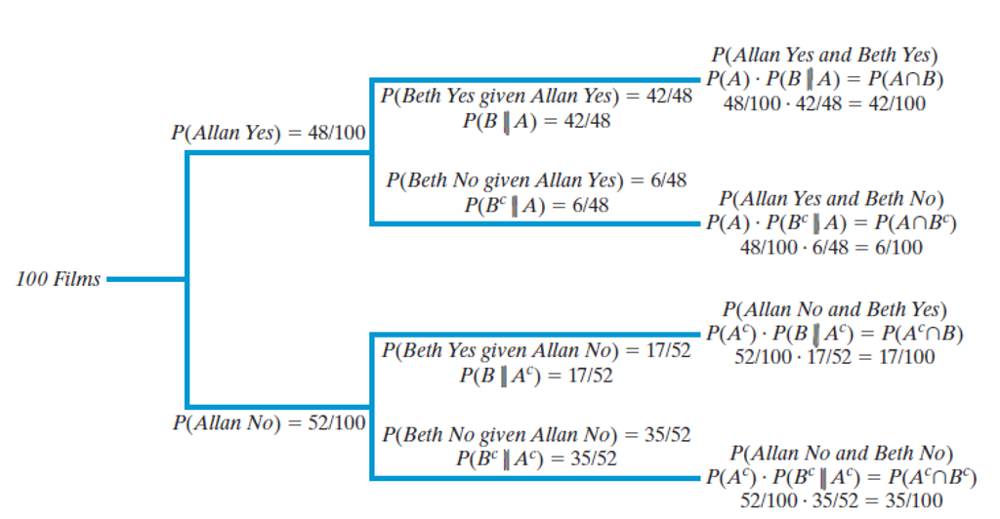

## Section 11.3 Learning Objectives {.center}

-   Calculate conditional probabilities from a table and from the definition.

-   Determine whether events are independent.

-   Use the general multiplication rule to calculate probabilities.

-   Use the multiplication rule to calculate probabilities for independent events.

-   Use tree diagrams to represent and calculate probabilities.

## Recap {.center}

-   Probability rules make calculations easier & precise

-   Probability basics:

    -   An event can be denoted with any capital letter

    -   The probability is denoted by P(Event)

        -   Note: Event ≠ P(Event)!

    -   Probability must be between 0 and 1!

        -   0 ≤ P(Event) ≤ 1

## Probability Rules {.center}

::: incremental
-   **Compliment rule:** $P(A^c)=1-P(A)$ = probability that "not $A$" occurs

-   **Intersection:** $P(A \cap B)$ = probability and both events $A$ and $B$ occur

-   **Union:** $P(A \cup B)$ = probability that $A$ or $B$ or both occur

    -   $P(A \cup B)=P(A) + P(B) - P(A \cap B)$

    -   If $A$ and $B$ are **mutually exlusive**: $P(A \cup B)=P(A) + P(B)$
:::

## Displaying Probability {.center}

Two primary ways of displaying probability:

-   Venn Diagram

-   Probability table

    -   Similar to a two way table from previous chapters

## Intro {.center}

-   Sometimes, one event may be dependent on another

    -   This is called **conditional probability**

-   In Ch. 4 and Ch. 5, we used conditional proportions

    -   Proportions were *conditional* on groups

-   We can also use conditional probability to tell if two events are independent

# Example: Watching Films

## Watching Films {.center}

-   In 2007, the American Film Institute created a list of top 100 American films ever made

-   Two people, Allan and Beth classified each film based on whether they had seen it or not

```{r message=FALSE, fig.align="center"}
library(dplyr)
library(gt)
library(janitor)
film <- data.frame(
  `1` = c("Allen Yes","Allen No","Total"),
  `2` = c("42","17","59"),
  `3` = c("6","35","41"),
  `4` = c("48","52","100")
)

film %>% gt() %>%
  cols_label(
    X1 = " ",
    X2 = "Beth Yes",
    X3 = "Beth No",
    X4 = "Total") %>%
  opt_stylize(style=6) %>%
  cols_align(align = "center",
             columns = everything()) %>%
  cols_width(everything() ~ px(275)) %>%
  tab_style(style = cell_borders(sides = "all"),
            locations = cells_body(everything())) %>%
  opt_table_font(size = px(34)) %>%
  tab_options(table.width = pct(100)) 

```

## Watching Films {.center}

-   A = Event that Allan has seen the movie

    -   $P(A)=\frac{48}{100}=0.48$

-   B = Event that Beth has seen the movie

    -   $P(B)=\frac{59}{100}=0.59$

```{r message=FALSE, fig.align="center"}
library(dplyr)
library(gt)
library(janitor)
film <- data.frame(
  `1` = c("Allen Yes","Allen No","Total"),
  `2` = c("42","17","59"),
  `3` = c("6","35","41"),
  `4` = c("48","52","100")
)

film %>% gt() %>%
  cols_label(
    X1 = " ",
    X2 = "Beth Yes",
    X3 = "Beth No",
    X4 = "Total") %>%
  opt_stylize(style=6) %>%
  cols_align(align = "center",
             columns = everything()) %>%
  cols_width(everything() ~ px(275)) %>%
  tab_style(style = cell_borders(sides = "all"),
            locations = cells_body(everything())) %>%
  opt_table_font(size = px(34)) %>%
  tab_options(table.width = pct(100)) 

```

## Watching Films {.center}

-   $P(B)=\frac{59}{100}=0.59$

-   If we know Allan has seen the movie, does Beth's probability of having seen the movie change?

    -   This is **conditional probability!**

```{r message=FALSE, fig.align="center"}
library(dplyr)
library(gt)
library(janitor)
film <- data.frame(
  `1` = c("Allen Yes","Allen No","Total"),
  `2` = c("42","17","59"),
  `3` = c("6","35","41"),
  `4` = c("48","52","100")
)

film %>% gt() %>%
  cols_label(
    X1 = " ",
    X2 = "Beth Yes",
    X3 = "Beth No",
    X4 = "Total") %>%
  opt_stylize(style=6) %>%
  cols_align(align = "center",
             columns = everything()) %>%
  cols_width(everything() ~ px(275)) %>%
  tab_style(style = cell_borders(sides = "all"),
            locations = cells_body(everything())) %>%
  opt_table_font(size = px(34)) %>%
  tab_options(table.width = pct(100)) 

```

## Conditional Probability {.center}

-   $P(B|A)$ is the [**conditional probability**]{.underline} of event $B$, given that event $A$ has occurred

    -   $P(A|B)$ would be event $A$ given $B$

. . .

Formula:

$$P(B|A)=\frac{P(A \cap B)}{P(A)}$$

## Watching Films {.center}

Probability that Beth has seen a movie, *given* that Allan has seen the movie.

$$P(B|A)=\frac{P(A \cap B)}{P(A)}$$

$$=\frac{42/100}{48/100}=\frac{42}{48}=0.875$$

. . .

This is higher than $P(B)=0.59$.

## Independent Events {.center}

-   Events A & B are said to be [**independent events**]{.underline} if $P(B|A)=P(B)$

    -   Likewise, if $P(A|B)=P(A)$

-   Essentially, one event having happened does not affect the probability of another event

-   Events that are not independent are referred to as [**dependent events**]{.underline}

## Watching Films {.center}

-   $P(B)=0.59$

-   $P(B|A)=0.875$

-   $0.59\neq 0.875$, so Allan having seen a movie and Beth having seen a movie are **not** independent events.

## Multiplication Rule {.center}

-   If we know $P(B|A)$ (or $P(A|B)$), we can use it to find $P(A \cap B)$

-   Multiplication rule formula:

$$P(A \cap B)=P(B|A)*P(A)=P(A|B)*P(B)$$

. . .

Note, this is the conditional probability formula rearranged!

## Multiplication Rule with Indpendent Events

If $A$ and $B$ are independent, the multiplication rule simplifies to:

$$P(A \cap B)=P(A)*P(B)$$

. . .

This is because for independent events, $P(A|B)=P(A)$ (and $P(B|A)=P(B)$).

## Mutually Exclusive Events {.center}

-   Recall: Mutually exclusive events are two events that cannot occur at the same time

    -   $P(A \cap B)=0$

-   [**Rule:**]{.underline} Two events that are mutually exclusive can NOT be independent (and vice versa)

## Example {.center}

Let $P(A)=0.5$ and $P(B)=0.3$, where $A$ and $B$ are mutually exclusive.

::: incremental
-   This means that $P(A \cap B)=0$
-   This implies that $P(B|A)*P(A)=0$
-   Since we know that $P(A)=0.5$, then $P(B|A)=0$
-   Then $P(B|A)=P(B)$, so $A$ & $B$ are not independent.
:::

## Tree Diagram {.center}

-   [**Tree diagrams**]{.underline} are useful ways to display conditional probabilities

{fig-alt="A tree diagram displaying the conditional probabilities from the watching films example. The first branch contains Allen's probability of having seen or not seen a film. Two branches extend from each of the previously described scenarios. The conditional probabilities of Beth having seen, or not seen a film are given for Allen having seen a film and for Allen not having seen a film." fig-align="center" width="850"}

## Tree Diagram Activity

Using the data below, sketch a tree diagram where event $D$ is the first set of branches.

```{r message=FALSE, fig.align="center"}
library(dplyr)
library(gt)
library(janitor)
tree <- data.frame(
  `1` = c("C","C'","Total"),
  `2` = c("28","26","54"),
  `3` = c("10","36","46"),
  `4` = c("38","62","100")
)

tree %>% gt() %>%
  cols_label(
    X1 = " ",
    X2 = "D",
    X3 = "D'",
    X4 = "Total") %>%
  opt_stylize(style=6) %>%
  cols_align(align = "center",
             columns = everything()) %>%
  cols_width(everything() ~ px(250)) %>%
  tab_style(style = cell_borders(sides = "all"),
            locations = cells_body(everything())) %>%
  opt_table_font(size = px(30)) %>%
  tab_options(table.width = pct(100)) 

```

